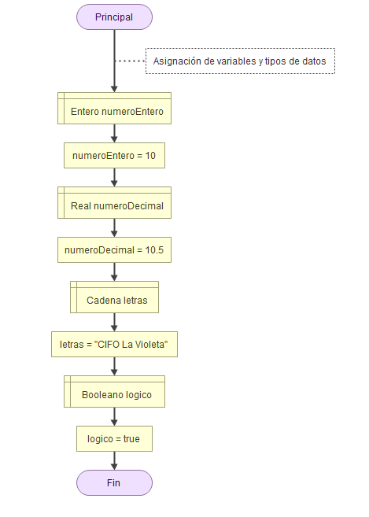

# Tipos de datos y variables

El primer paso que tenemos que realizar a la hora de crear cualquier algoritmo es etiquetar ese dato (asignarlo a una variable) y definir el tipo de dato que va a ser. 

Ya sabemos una primera definición de *variable*, que es un contenedor donde podemos almacenar información, que puede *variar* a lo largo de la ejecución del programa. Una definición más acertada sería: ***una etiqueta que asignamos a un dato para identificarlo.***

Tipos de datos simples o primitivos que podemos usar en nuestros algoritmos:

* Numéricos: que pueden ser enteros o decimales (también llamados de punto flotante).
* Cadenas de carácteres: carácteres alfanuméricos, como apunte siempre van encerrados entre comillas dobles ("").
* Lógicos o booleanos: sólo pueden tomar dos valores (*true* o *false*).

---

## Créditos

Última revisión: Mayo 2024

Este dosier forma parte del curso "Algoritmia y Programación con Python", por Manu Plaza Salas para  CIFO Barcelona La Violeta.

Esta obra está bajo una [licència](http://creativecommons.org/licenses/by-nc-sa/4.0/)[ de Creative ](http://creativecommons.org/licenses/by-nc-sa/4.0/)[Commons](http://creativecommons.org/licenses/by-nc-sa/4.0/)[Reconeixement-NoComercial-CompartirIgual](http://creativecommons.org/licenses/by-nc-sa/4.0/)[ 4.0 Internacional](http://creativecommons.org/licenses/by-nc-sa/4.0/).
