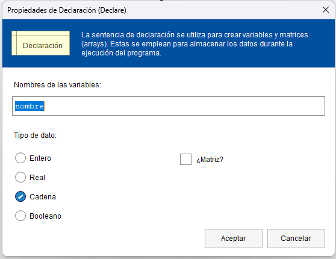

# Estructuras secuenciales

## Declaración de variables y asignación de valores

El primer paso que debemos realizar a la hora de empezar nuestro algoritmo es la declaración de las variables que vayamos a usar

En este paso le asignaremos un nombre y definiremos el tipo de dato que es.

Posteriormente podemos o bien asignarle un valor manualmente:

O bien podemos hacer que sea el usuario el que realice la entrada del dato:

Para posteriormente realizar la salida de datos

## Operador para concatenar cadenas

Como vemos en este caso, para concatenar texto literal (entre comillas) con variables, usamos el símbolo "&", teniendo en cuenta que los espacios los usamos simplemente para mejorar la legibilidad de nuestras expresiones.

## Operadores aritméticos básicos

* "+": Suma (Ej. 5 +3)
* "-": Resta (Ej. 8 - 2)
* "*": Multiplicación ( Ej. 5 * 2)
* "/": División (Ej. 9 / 3)
* "%" : Resto de la división o Módulo (Ej. 8 % 3)
* "^": Exponente ( 2 ^ 3)

---

## Créditos

Última revisión: Mayo 2024

Este dosier forma parte del curso "Algoritmia y Programación con Python", por Manu Plaza Salas para  CIFO Barcelona La Violeta.

Esta obra está bajo una [licència](http://creativecommons.org/licenses/by-nc-sa/4.0/)[ de Creative ](http://creativecommons.org/licenses/by-nc-sa/4.0/)[Commons](http://creativecommons.org/licenses/by-nc-sa/4.0/)[Reconeixement-NoComercial-CompartirIgual](http://creativecommons.org/licenses/by-nc-sa/4.0/)[ 4.0 Internacional](http://creativecommons.org/licenses/by-nc-sa/4.0/).
