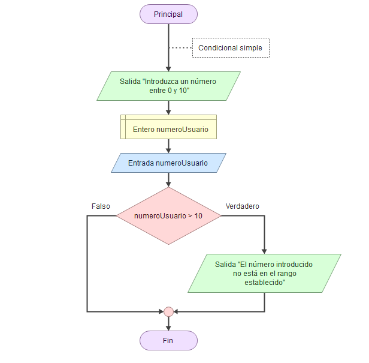
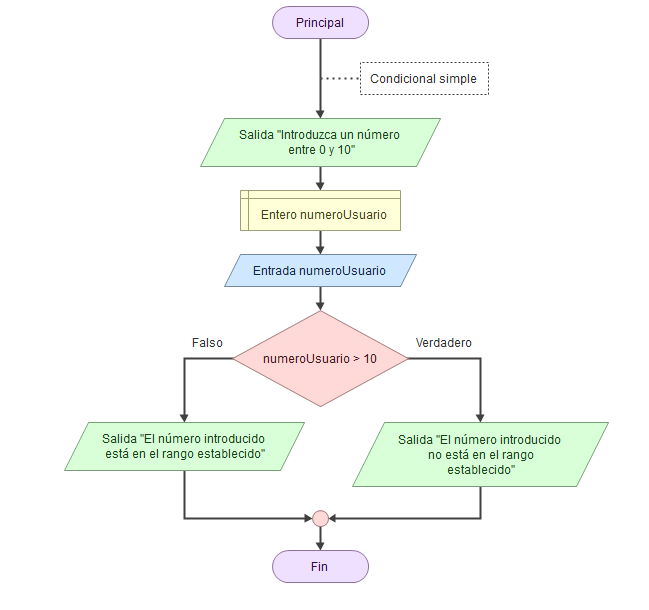
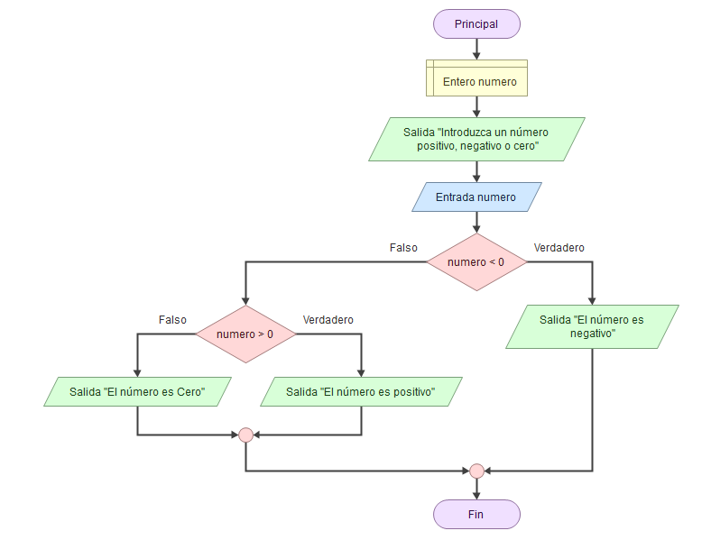

# Estructuras condicionales

Las estructuras condicionales nos permiten que el flujo natural de nuestro algoritmo (secuencial), vaya por un camino u otro en función de una condición establecida.

## Condicional simple "Si"

Al ejecutarse la instrucción `si` se evalúa la condición lógica. Si la condición lógica es **Verdadera** se ejecutan de manera secuencial el bloque de instrucciones  *Salida...* . Si la condición es **Falsa** no se ejecuta el bloque de instrucciones. Una vez ejecutado el `si` (opción verdadera o falsa) se continúa la ejecución de forma secuencial por la siguiente instrucción, en caso de haberla.

## Condicional doble "Si - Si no"

En esta otra opción, en caso de no cumplirse la condición, se ejecutarán otra serie de instrucciones *Salida...* 

## Condicionales anidados

En caso de necesitarlo, podemos anidar tantos condicionales como deseemos. En el caso de arriba, en caso de que no se cumpla la primera condición, hacemos una segunda evaluación, y en función del resultado de comparación, obtendremos diversas salidas.

## Operadores de comparación

| Operador | Descripción    |
| :------: | --------------- |
|    <    | Menor que       |
|    <=    | Menor o igual a |
|    >    | Mayor que       |
|    >=    | Mayor o igual a |
|    ==    | Igual           |
| != ó <> | Diferente       |

---

Última revisión: Mayo 2024

Este dosier forma parte del curso "Algoritmia y Programación con Python", por Manu Plaza Salas para  CIFO Barcelona La Violeta.

Esta obra está bajo una [licència](http://creativecommons.org/licenses/by-nc-sa/4.0/)[ de Creative ](http://creativecommons.org/licenses/by-nc-sa/4.0/)[Commons](http://creativecommons.org/licenses/by-nc-sa/4.0/)[Reconeixement-NoComercial-CompartirIgual](http://creativecommons.org/licenses/by-nc-sa/4.0/)[ 4.0 Internacional](http://creativecommons.org/licenses/by-nc-sa/4.0/).
