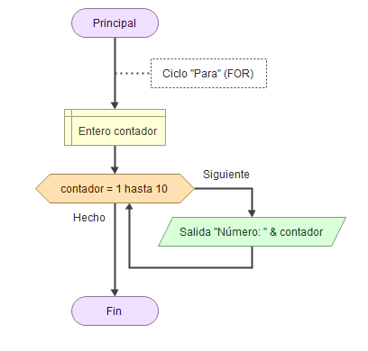
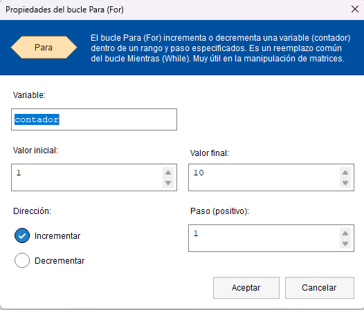
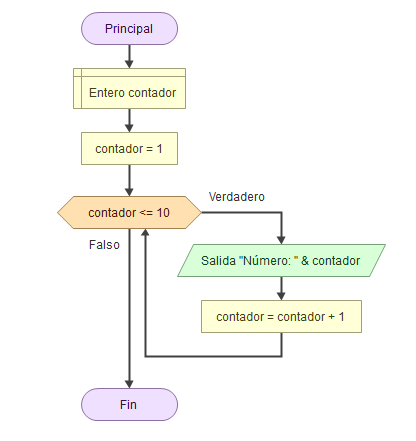
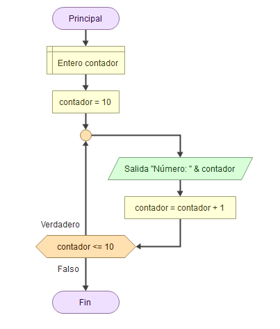

# Estructuras iterativas

Las estructuras iterativas (también llamadas estructuras repetitivas, ciclos o bucles), nos permiten ejecutar una serie de instrucciones un número determinado de veces o bien mientras se cumple determinada condición.

## Ciclo FOR o PARA

La instrucción `Para` ejecuta una secuencia de instrucciones un número determinado de veces.

* Al ingresar al bloque, la variable `contador` recibe el `valor inicial` y se ejecuta la secuencia de instrucciones que forma el cuerpo del ciclo.
* Luego se incrementa la variable `contador` en `paso` unidades y se evalúa si el valor almacenado en `contador` superó al `valor final`.
* Si esto es falso se repite hasta que `contador` supere a `valor final`.
* Por defecto, el Paso es de a `1` y la dirección `Incrementar`. Podemos modificar el paso según lo necesitado y la dirección a `Decrementar`.

## Ciclo WHILE o Mientras

La instrucción `Mientras` ejecuta una secuencia de instrucciones mientras una condición sea verdadera.

* Al ejecutarse esta instrucción, la condición es evaluada. Si la condición resulta verdadera, se ejecuta una vez la secuencia de instrucciones que forman el cuerpo del ciclo. Al finalizar la ejecución del cuerpo del ciclo se vuelve a evaluar la condición y, si es verdadera, la ejecución se repite. Estos pasos se repiten mientras la condición sea verdadera.
* Se puede dar la circunstancia que las instrucciones del bucle no se ejecuten nunca, si al evaluar por primera vez la condición resulta ser falsa.
* Si la condición siempre es verdadera, al ejecutar esta instrucción se produce un ciclo infinito. A fin de evitarlo, las instrucciones del cuerpo del ciclo deben contener alguna instrucción que modifique la o las variables involucradas en la condición, de modo que ésta sea falsificada en algún momento y así finalice la ejecución del ciclo.

## Ciclo DO WHILE o Hacer

La instrucción `Hacer` ejecuta una secuencia de instrucciones hasta que la condición sea verdadera.

* Al ejecutarse esta instrucción, la secuencia de instrucciones que forma el cuerpo del ciclo se ejecuta una vez y luego se evalúa la condición. Si la condición es falsa, el cuerpo del ciclo se ejecuta nuevamente y se vuelve a evaluar la condición. Esto se repite hasta que la condición sea verdadera.
* Hay que tener en cuenta que, dado que la condición se evalúa al final, las instrucciones del cuerpo del ciclo serán ejecutadas al menos una vez.
* Además, a fin de evitar ciclos infinitos, el cuerpo del ciclo debe contener alguna instrucción que modifique la o las variables involucradas en la condición de modo que en algún momento la condición sea verdadera y se finalice la ejecución del ciclo.

---

Última revisión: Mayo 2024

Este dosier forma parte del curso "Algoritmia y Programación con Python", por Manu Plaza Salas para  CIFO Barcelona La Violeta.

Esta obra está bajo una [licència](http://creativecommons.org/licenses/by-nc-sa/4.0/)[ de Creative ](http://creativecommons.org/licenses/by-nc-sa/4.0/)[Commons](http://creativecommons.org/licenses/by-nc-sa/4.0/)[Reconeixement-NoComercial-CompartirIgual](http://creativecommons.org/licenses/by-nc-sa/4.0/)[ 4.0 Internacional](http://creativecommons.org/licenses/by-nc-sa/4.0/).
