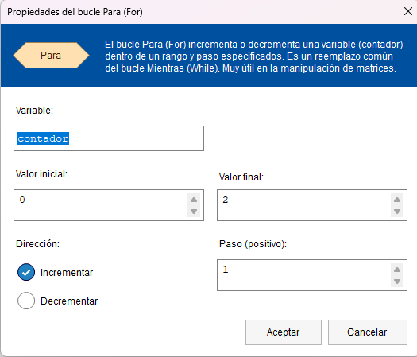

# Estructuras de datos

Hasta ahora, para hacer referencia a un dato utilizábamos una variable. El problema se plantea cuando tenemos gran cantidad de datos que guardan entre sí una relación. No podemos utilizar una variable para cada dato.

Para resolver estas dificultades se agrupan los datos en un mismo conjunto, estos conjuntos reciben el nombre de  **estructura de datos** .

## Arregos o arrays

Un array (o arreglo) es una estructura de datos con elementos homogéneos, del mismo tipo, numérico o alfanumérico, reconocidos por un nombre en común. Para referirnos a cada elemento del array usaremos un índice (empezamos a contar por 0).

## Declaración de un array

Asignaremos un nombre al array, el tipo de dato que vamos a tratar, y su tamaño (longitud o dimensión).

## Acceso a los datos del array

Para acceder a cada uno de los datos de un array, usaremos su índice encerrado entre corchetes "[]": `nombreArray[indice]`

Para acceder a todos los elementos de un array, podemos hacer uso de un bucle (el ideal es el bucle **PARA** o **FOR**).

Como el índice de un array siempre empieza por el número "0", la última posición siempre será la longitud del array menos 1. 

Ejemplo:

En este caso podemos observar lo siguiente:

* Declaramos un array de cadenas de carácteres con una longitud de 3 elementos.
* Inicializamos manualmente cada uno de los elementos del array, accediendo por su índice.
* Declaramos un contador para el bucle FOR.
* Recorremos el array empezando por la posición 0 (primer índice) hasta la posición 2 (longitud 3, restamos 1).

---

Última revisión: Mayo 2024

Este dosier forma parte del curso "Algoritmia y Programación con Python", por Manu Plaza Salas para  CIFO Barcelona La Violeta.

Esta obra está bajo una [licència](http://creativecommons.org/licenses/by-nc-sa/4.0/)[ de Creative ](http://creativecommons.org/licenses/by-nc-sa/4.0/)[Commons](http://creativecommons.org/licenses/by-nc-sa/4.0/)[Reconeixement-NoComercial-CompartirIgual](http://creativecommons.org/licenses/by-nc-sa/4.0/)[ 4.0 Internacional](http://creativecommons.org/licenses/by-nc-sa/4.0/).
