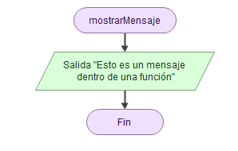
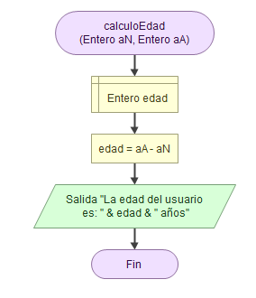

# Programación estructurada (funcional)

La programación estructurada (modular o funcional) es un paradigma de la programación orientado a mejorar la claridad, la calidad y el tiempo de desarrollo de un programa o algoritmo, usando subrutinas (funciones o procedimientos) y tres estructuras: secuencial, condicional e iterativa.

Este paradigma de la programación consiste en dividir un programa entero en módulos o subprogramas para hacerlo más legible y manejable.

Cuando aplicamos programación modular, un problema complejo lo dividimos en diversos subproblemas más simples, y éstos a su vez en otros más simples todavía.

Además, el hecho de usar subrutinas nos permite reulitzar código y no tener que repetirlo infinidad de veces.

## Tipos de subrutinas

Tenemos dos clases de subrutinas:

* Funciones: una subrutina que devuelve un valor.
* Procedimientos: una subrutina que devuelve ningún resultado.

Cada una de ellas tiene dos fases de ejecución: definición y llamada.

Para poder hacer uso de una subrutina, primero ésta tiene que estar definida. Es la parte en la que definimos todas las acciones que va a llevar a cabo.  La segunda fase, la llamada, es cuando vamos a decirle que ejecute las acciones que hemos definido.

## Parámetros y argumentos

Tanto las funciones como los procedimientos pueden llevar argumentos o parámetros, y aunque son prácticamente lo mismo, conviene diferenciarlos:

* Parámetros: son las variables que recibe la función y se crean cuando la definimos. Su contenido lo reciben cuando llamamos a la función con los argumentos.
* Argumentos: son las expresiones que usamos cuando llamamos a la función.

## Scope o ámbito de las variables

Las variables definidas dentro de una función no existen en otras funciones o el programa principal. De la misma forma, las variables del programa principal no existen dentro de la función. (Nota: aunque ésto no es del todo cierto en algunos lenguajes de programación como JavaScript).

## Ejemplos:

### Procedimiento sin parámetros

### Procedimiento con parámetros

### Función con parámetros

---

Última revisión: Mayo 2024

Este dosier forma parte del curso "Algoritmia y Programación con Python", por Manu Plaza Salas para  CIFO Barcelona La Violeta.

Esta obra está bajo una [licència](http://creativecommons.org/licenses/by-nc-sa/4.0/)[ de Creative ](http://creativecommons.org/licenses/by-nc-sa/4.0/)[Commons](http://creativecommons.org/licenses/by-nc-sa/4.0/)[Reconeixement-NoComercial-CompartirIgual](http://creativecommons.org/licenses/by-nc-sa/4.0/)[ 4.0 Internacional](http://creativecommons.org/licenses/by-nc-sa/4.0/).
