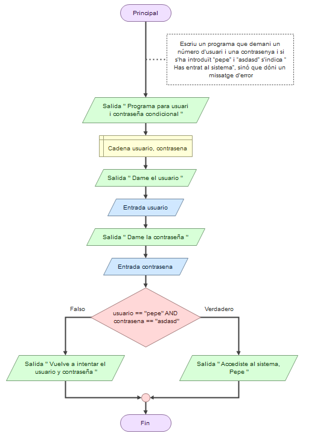
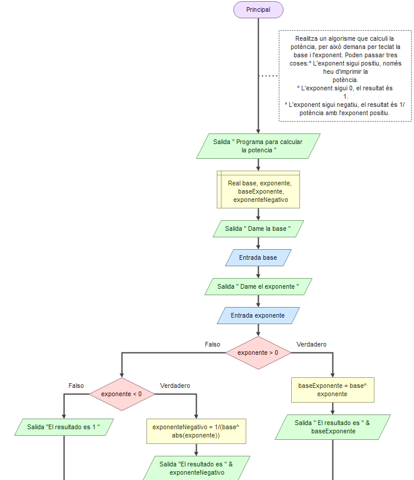
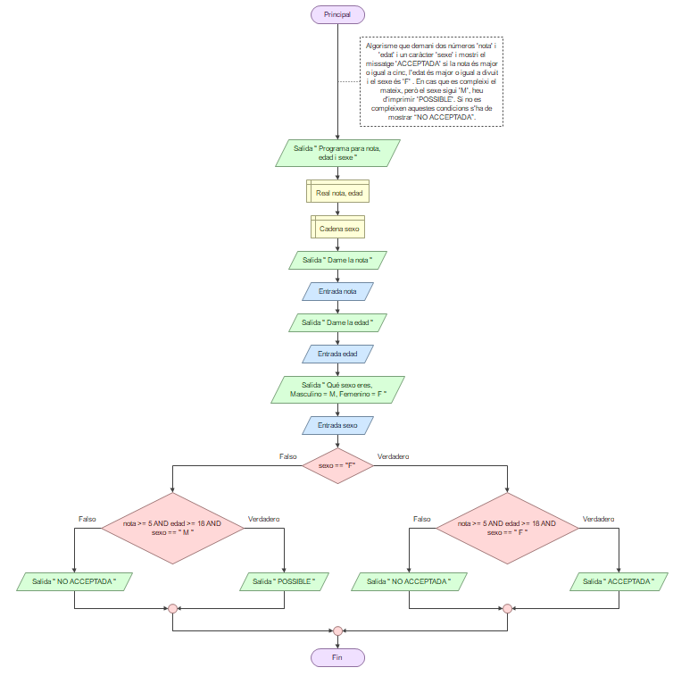
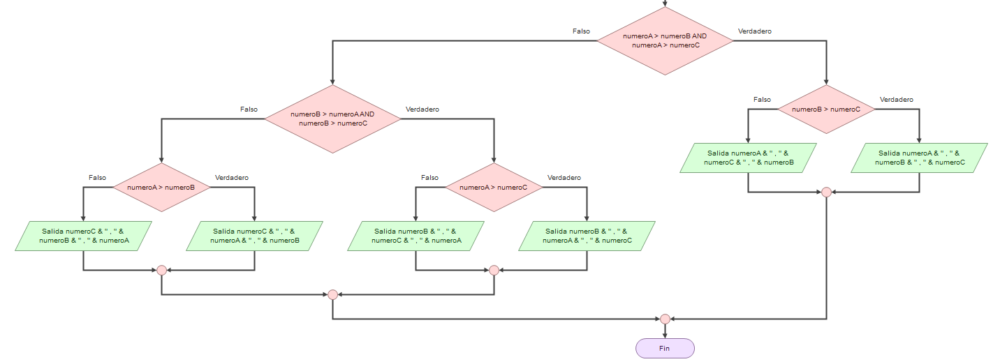
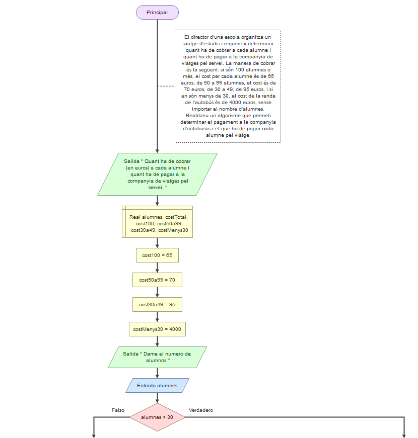
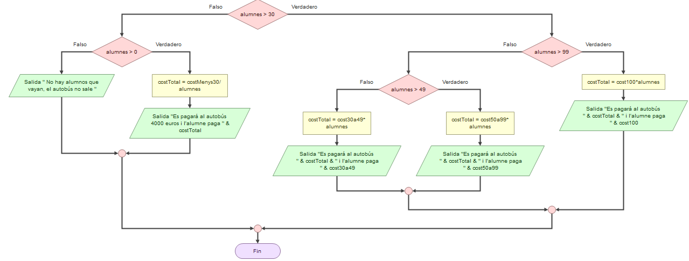
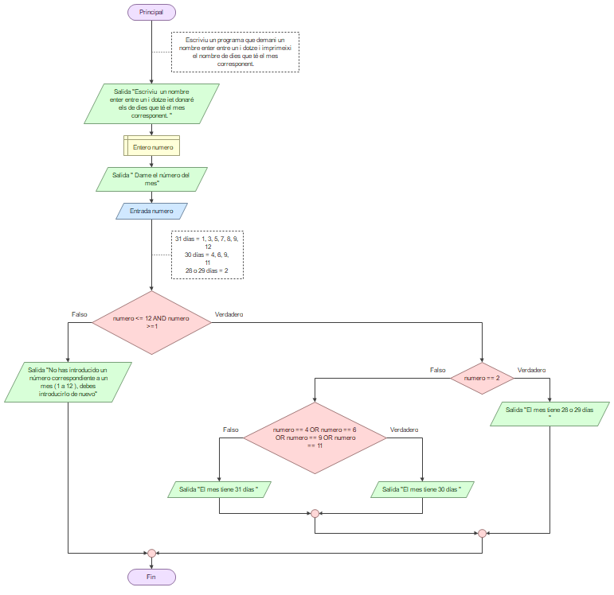

08/05/24

# Markdown Editor

Plug-in de Microsoft:

**Aprendemos a tomar apuntes en formato “markdown”

Plug-in de visualstudio code para ver las imagenes (ir a engranaje, Extensiones)

**Desde la carpeta tienes que abrir con boton derecho “abrir con code”

Esto te permite tomar apuntes y también código.

# Estructuras condicionales

## Pràctica3. Estructures condicionals

1. Desenvolupa els següents algorismes:* Escriu un programa que demani un número d'usuari i una contrasenya i si s'ha introduït “pepe” i “asdasd” s'indica “Has entrat al sistema”, sinó que dóni un missatge d'error.
   
2. Realitza un algorisme que calculi la potència, per això demana per teclat la base i l'exponent. Poden passar tres coses:

* L'exponent sigui positiu, només heu d'imprimir la potència.
* L'exponent sigui 0, el resultat és 1.
* L'exponent sigui negatiu, el resultat és 1/potència amb l'exponent positiu.

* 
* Algorisme que demani dos números 'nota' i 'edat' i un caràcter 'sexe' i mostri el missatge 'ACCEPTADA' si la nota és major o igual a cinc, l'edat és major o igual a divuit i el sexe és 'F' . En cas que es compleixi el mateix, però el sexe sigui 'M', heu d'imprimir 'POSSIBLE'. Si no es compleixen aquestes condicions s'ha de mostrar “NO ACCEPTADA”.

* Algorisme que demani tres números i els mostri ordenats (de major a menor)

mejora por si tienes números iguales: el 8 8 3 no me funciona

(pasar el bueno)

* El director d'una escola organitza un viatge d'estudis i requereix determinar quant ha de cobrar a cada alumne i quant ha de pagar a la companyia de viatges pel servei. La manera de cobrar és la següent: si són 100 alumnes o més, el cost per cada alumne és de 65 euros; de 50 a 99 alumnes, el cost és de 70 euros, de 30 a 49, de 95 euros, i si en són menys de 30, el cost de la renda de l'autobús és de 4000 euros, sense importar el nombre d'alumnes. Realitzeu un algorisme que permeti determinar el pagament a la companyia d'autobusos i el que ha de pagar cada alumne pel viatge.

  

  
* Escriviu un programa que demani un nombre enter entre un i dotze i imprimeixi el nombre de dies que té el mes corresponent.

