# Estructura iterativas

3 tipos

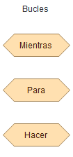

ciclos do o hacer

  Los otros dos no sabemos cuantas veces, dependen de una condición

## CICLO FOR: (o para)

Tenemos que usar una variable para la cantidad de veces del contador

**Sabemos cantidad de iteraciones que se van a realizar**

Dar valor inicial del contador ( 0 o 1)

Y el valor final 9 (si el primero era 0), para que haga 10 ciclos

puede ser de incrementar o decrementar

Funciones un número determinado de veces (iteraciones) que conocemos

Para hacer tabla mutiplicar, o para hacer operaciones un número de veces.

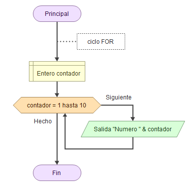

Ejemplo valor inicial 1 hasta 10:

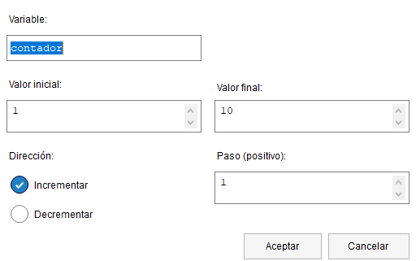

## CICLO WHILE: (o mientras)

Aquí lo que establecemos es una condicion (numérica o no, como un boleano, letras...)

Ha de tener un control para parar el bucle (debajo de la salida), en este caso para que siga después del 1

no sabemos cuantas veces, dependen de una condición

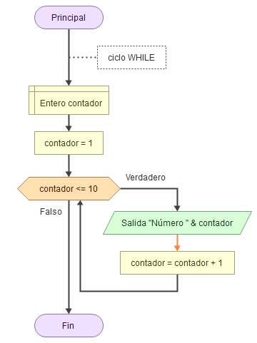

## Ciclo DO WHILE: (o hacer)

La orden se ejecuta como mínimo una vez

no sabemos cuantas veces, dependen de una condición

Primero haces una condición de verdadero o falso

usarlo para cuando las funciones del bucle como mínimo hayan de producirse 1 vez

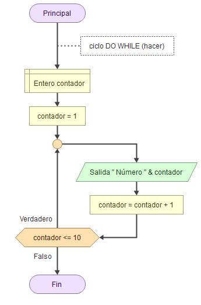

## WHILE vs DO while

en el while si no se cumple condición, no se va a producir.

En do while, todo y que variable inicial no cumpla condición si se produce el primer ciclo

# Ejercicios o Aplicaciones

Realizar un algoritmo que pida numeros (se pedirá por teclado la cantidad de números a introducir). El programa debe informar de cuantos números introducidos son mayores que 0, menores que 0 e iguales a 0.

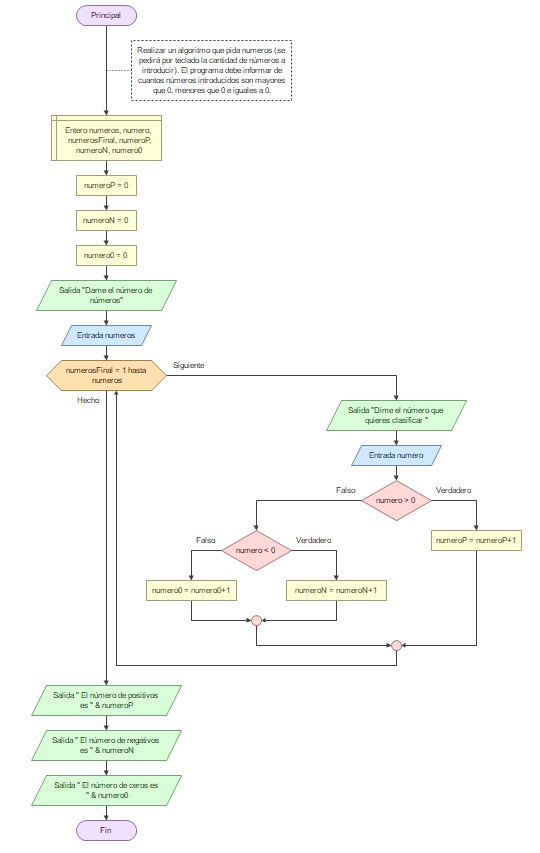

Profe:

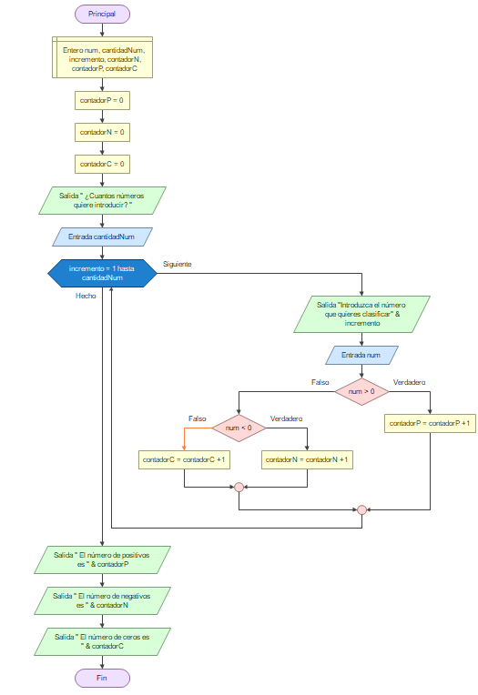

Algoritmo que pida números hasta que se introduzca un cero. Debe imprimir la suma y la media de todos los números introducidos.

-Mio

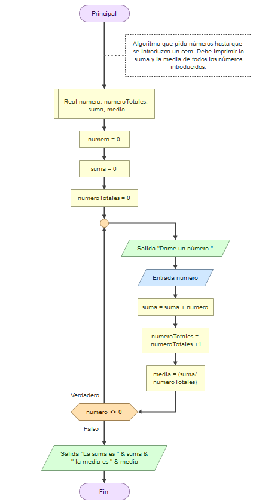

-Profe

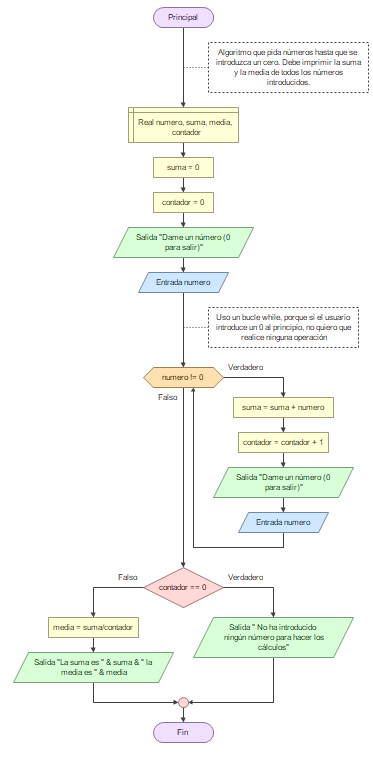

y para controlar los decimales:

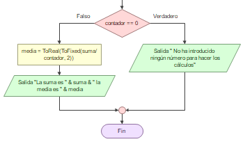

contador es el numero de datos que va introduciendo el usuario

while porque si el usuario te da un 0, no quiere que ejecute ningún cálculo

Si no pulsa 0, la suma se va acumulando junto al contador

Al poner 0, salta y evalua:

    -Primer resultado es 0

    -Si el primero no es 0, calcula la media

ToFixed convierte lo de dentro en una cadena "XXXX", para volver a un número real has de poner ToReal antes.

*Crea una aplicación que permita adivinar un número. La aplicación va a generar un número aleatorio del 0 al 100. A continuación, va pidiendo números y va respondiendo si el número a adivinar es mayor o menor que el introducido. Además, los intentos que te quedan (tienes 10 intentos para acertarlo). El programa temina cuando se acierta el número (además te dice cuantos intentos lo has acertado), si se llega al limite de intentos te muestra el número que había generado.

    función Random (101), para generar un número aleatorio del 0 al 100 (es decir, entre 0 y el número que le demos, menos 1)

-Mio

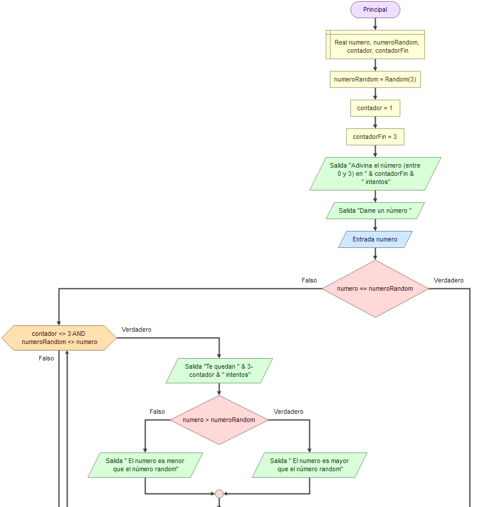

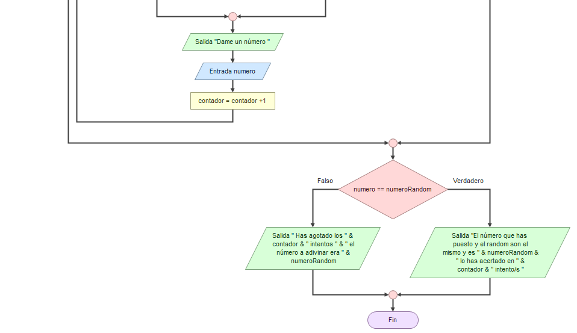

Se puede optimizar el mío

-Profe

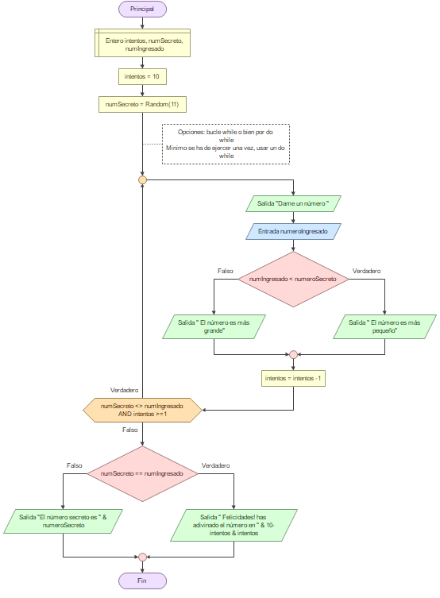

    segunda versión en el mobil (pasarlo)

10/05/24

Escribir un programa que imprima todos los números pares entre dos números que se le pidan al usuario

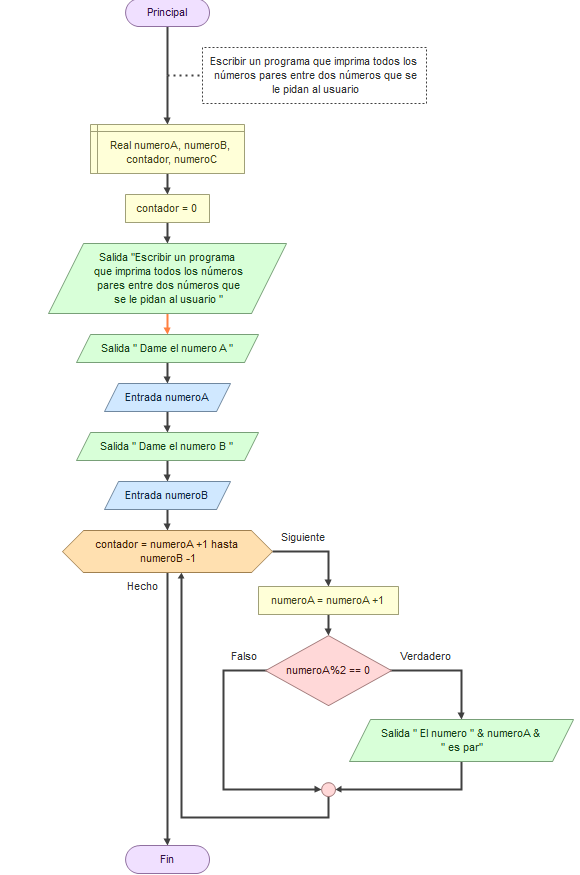

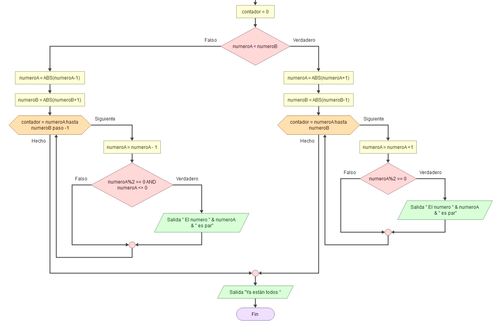

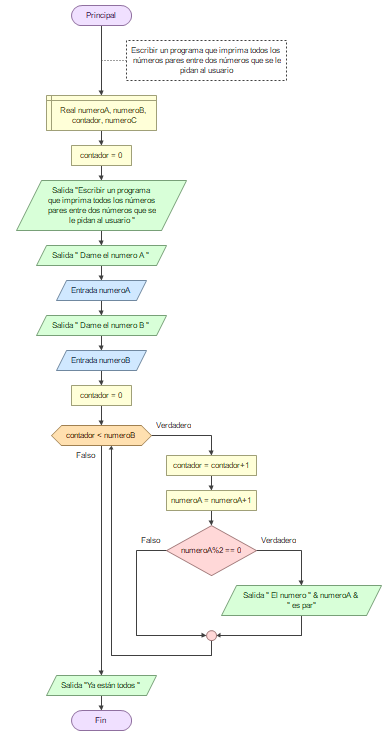

-profe:

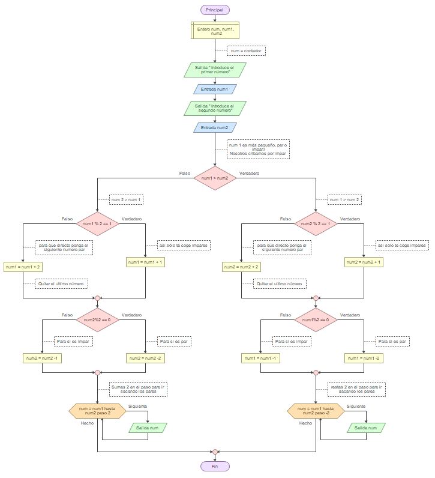

    para negativos lo duplicas y pones valores absoultos y, al final multiplicas por -1

esta disposición del codigo es aurea, y es elegante! Algo fundamental para una empresa

Ejercicio extra:

*Realizar un algoritmo que muestre la tabla de multiplicar de un número introducido por teclado

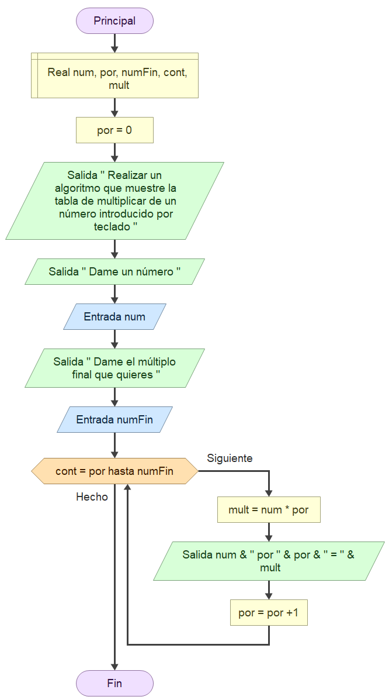
