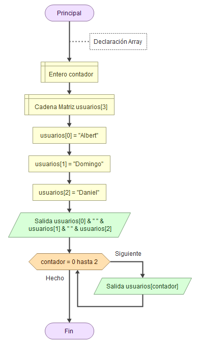
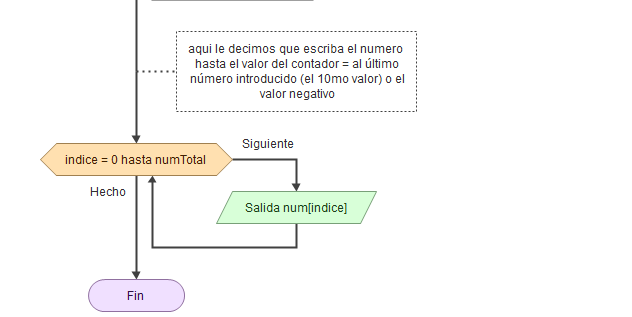

# Estructuras de datos

Las matrices en python no existen, están en un modulo externo y se tienen que importar.

## Una Array / Matriz / Arreglo

Si tenemos que almacenar unos nombres dentro de una variable (en una clase)

 Sería tal que:

- alumno1
- alumno2
- alumno3...
- alumnoN

-**Array es una estructura que puede almacenar tantos datos como queramos.** Tiene un valor tal que:

array [valor1, valor2, valor3... valorN]

    El valor puede ser entero, real cadena de caracteres o boleano, pero siempre el mismo tipo de dato (no en todos los lenguajes).

-Tiene siempre un í**ndice que empieza siempre por 0, que corresponde al valor 1, el índice del ultimo valor será la longitudArray-1**

## Ejemplos

nombre variable, tipo de dato + matriz y tamaño

nombre variable y entre corchetes el nombre del índice

Consola nos da:

## La función PARA junto a las Array

La función PARA es de vital importancia para leer una array si es muy larga:

Tienes que tener una variable contador declarada antes, para hacer el bucle y poder representar los valores dentro del array.

Array para introducir datos:

declarar la variable del numero total de la matriz

## Para guardar una array

Ahora falta iniciar cada uno de los indices:

    para ello tendremos la variable contador, en la salida le tenemos que poner contador +1(para que el usuario lo vea), ya que el contador que vale 0 es el alumno 1, e indice de la Array = 0!

Ayuda -> documentación tienes las -> funciones intrinsecas -> Size () , para saber la cantidad de datos que tiene el array

    Size () , para saber la cantidad de datos que tiene el array, o la longitud de la misma array

Ahora recorremos de nuevo la array:

 **el segundo bucle recorre la array**  y te printa el alumno con el índice.

## Ejercicios:

*Realizar un programa que defina un vector llamado "vector_numero" de 10 enteros, a continuación lo inicialice con valores aleatorios ( del 1 al 10) y posteriormente muestre en pantalla cada elemento del vector junto con su cuadrado y su cubo.

- mio

- Profe

* Se requiere realizar un programa que lea por teclado las 5 notas obtenidas por un alumno ( comprendidas entre 0 y 10). A continuación debe mostrar todas las notas, la nota media, la nota más alta que ha sacado y la menor.

- Profe

*Crear un vector de 5 elementos de cadenas de caracteres, inicializa el vector con datos leídos por el teclado. Copia los elemenos del vector en otro vector pero en orden inverso, y muestralo por pantalla.

*Programa que declare un vector de diez elementos enteros y pida números para rellenarlo hasta que se llene el vector o se introduzca un número negativo. entonces se debe imprimir el vector (sólo los elementos introducidos)

 Con este cambio usando el -1 me evito de que salga el número negativo. Aún así no es recomendable usar el PARA, sólo usarlo en numero determinado de iteraciones.

-Profe

*Hacer un programa que inicialice un vector de números (10 enteros) con valores aleatorios, y posteriormente ordene los elementos de menor a mayor.

*Queremos guardar los nombres y las edades de los alumnos de un curso. Realiza un programa que introduzca el nombre y la edad de cada alumno. El proceso de lectura de datos terminará cuando se introduzca como nombre un asterisco ( " * " ). Al finalizar se mostrará los siguientes datos:

    -Todos los alumnos mayores de edad.

    -El alumno mayor (el que tiene más edad)

