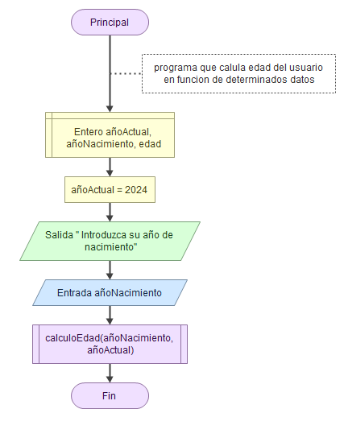

No haremos matrices de dos dimensiones porque flowgorithm no deja.

29 de mayo teoria y 30 práctica avaluación final módulo de intro a la programación

# Programación Funcional

Paradigma de la programación.

Crear subrutinas de un programa para poder reutilizar-las.

    Por ejemplo, tenemos la función o subrutina multiplicar y la vas llamando para cuando quieras multiplicar

## Procedimientos y Funciones

**Procedimiento:** nunca retornan un valor.

**Función**: siempre retorna un valor. a una determinada llamada

    A nivel práctico siempre se llama a todo función.

**Ambas:**

    - pueden llevar argumentos o variables con un valor que les vamos a insertar. No es obligatorio que lo tengan

    - Tienen**dos partes:**

    **Definición:** puedes llamar a parámetros

    **Invocación:** le pasas a la función los argumentos.

    parametros y argumentos es lo mismo, solo que el parámetro 		  pasado a función es el argumento. Son variables

Los argumentos se pueden pasar por valor o referencia:

    Como valor le pasas un número, cadena o lógico

    Como referencia le pasas una variable, que tiene un valor dentro

## Ejemplos Parámetros y Funciones

En flowgorithm:

Procedimiento sin parámetro

[Para python todo son objetos y, por tanto , la programación se hace orientada a objetos.]

Hasta ahora tenemos subrutinas:

 

hacemos una salida:

ahora vamos a principal:

 el parentesis vacio sirve para:

    Si encontramos a un nombre reservado, va a ser una función o metodo. Si el parentesis está vació va a ser un metodo o función.

Lo ejecutamos y te muestra el mensaje que habiamos puesto en la salida del mostrarMensaje.

Esto lo guardo y lo llamo "procedimiento sin parametros".

Abrimos uno nuevo procedimiento con parametros:

El primer parametro será primer argumento y así consecutivamente, ya que el nombre de parámetro (podrías poner el nombre tal cual, pero se usa uno acortado)

Hacemos función:

El orden tiene que ser el mismo al que hemos puesto antes. Simplemente le estamos poniendo una etiqueta

Como ningun retorno y aceptar

Vamos a principal y le das a play

**Hay que tener en cuenta el ambito de las variables o scope del locke:**

* Una variable sólo existe dentro de la función, no está en el principal.
* Una variable declarada en la función principal sóo está en esta.

No siemrpe es así, pero sí por defecto.

**Una vez la función se deja de ejecutar esa variable no existe.**

La edad tiene ambito en la principal, pero no en la función y al inreves.

Lo guardo como procedimiento con parametros.

Ahora mismo programa, pero en vez de ser procedimiento será una función, por lo tanto retorna un valor:

En edad vamos a almacenar el resultado de calculo de edad.

Ahora hacemos función

Aqui si retorno, edad

Volvemos a principal

El amito local tiene la funcion edad de la funcion

El ambito principal de edad se encuentra en el la funcion principal

Lo que estamso haciendo es dividir el procedimiento en procesos más pequeños, por lo que si una función de estas falla el programa no deja de funcionar, pero el resto de programa si va a funcionar.

Lo guardo como función como parámetros

## **Ejercicios**

*Crear un programa que pida dos número enteros al usuario y diga si alguno de ellos es múltiplo del otro. Crea una función esMultiplo que reciba los dos números, y devuelve si el primero es múltiplo del segundo.

-Con retorno

Ahora sin retorno:

 -Profe:

*Crear una función que calcule la temperatura media de un dia a partir de dos valores (temperatura máxima y temperatura mínima). Crear n programa principal, que utilizando la función anterior, vaya pidiendo la temperatura máxima y mínima de cada día y vaya mostrando la media. El programa pedirá el número de días que se van a introducir.

-Mio

-Profe:

*Crea una función "calcularMaxMin" que recibe una array con valores númerico y devuelve el valor máximo y el mínimo. Crea un programa que llene el array con números aleatorios y muestre el máximo y el mínimo, utilizando la función anterior.

170524

-Profe

*Escribir dos funciones que permitan calcular:

    -La cantidad de segundos en un tiempo dado en horas, minutos y segundos.

    -La cantidad de horas, minutos y segundos de un tiempo dado en segundos.

Escribe un programa principal con un menú donde se pueda elegir la opción de convertir a segundos, convertir a horas, minutos y segundos o salir del programa.

-Mio

Otra versión:

Profe:

Con Int() le quitas los decimales al número de dentro.
