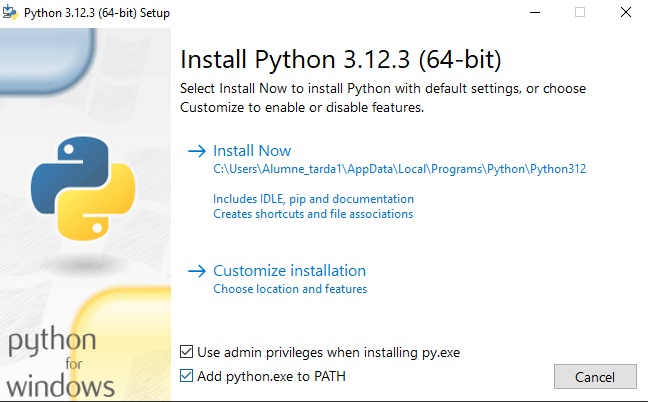
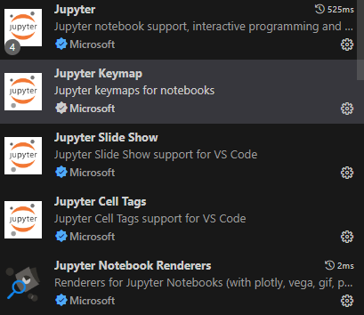

## Antes de empezar

para saber si tengo python:

**Windows -> cmd -> "python" o "python3" dependiendo de la versión,** si no te sale la consola no lo tienes instalado

    Si ya lo tienes:

    **-"import this" te muestra las normas de python y se debe seguir a rajatabla.**

    La espacialidad del codigo importa.

    Si rompe la regla no son tan especiales

    Ambigüedad evitarla!

    Ahora es mejor que nunca.

    Hacer tu propio código.******************

Para **salir de la consola usas "quit()"**

Lógica, mente analítica, conocimientos de matemáticas, capacidad de abstracción.

https://www.python.org/

al instalar la versión estable!

marcar el path para que luego lo puedas pasar a visual studio code

## Entorno de Visual Studio Code

Entorno de desarrollo o IDE -> Visual Studio Code

Trabajamos con Jupter notebook, para apuntes y tendras librería de datos

Práctica con visual studio. Es un editor de código.

Todos los archivos de python acaban en "py"

## Jupyter notebook

Instalar jupyiter notebook necesitas una extensión del visual estudio code.

Puedes tener markdown y codigo + ejecutable.

Abrimos carpeta

 "intro_programacion"
