# Fonaments de Programació (PDF)

## **¿Qué es programar?**

Programar: Programar és escriure instruccions  específiques perquè una máquina entengui,  processi i executi una sèrie de tasques.

Todos los procesos que hacemos “és programar”, entonces todo lo que hacemos en el ordenador lo es. Incluso las IA al calcular o al hacer busquedas en ellas, es programar, lo que lo hace muy rápido porque ya lo tienen codificado.

Quan parlem de màquines ens referim a  tots els “sistemes” que puguin processar informació (Ordinador, tablet,smartphone,  electrodoméstics,…)

Todo tiene sistemas de procesamiento. Un smartwatch es mucho más potente en unidades de procesamiento que un ordenador de la nasa de hace 30 años

## **Què és un llenguatge de programació?**

Un llenguatge de programació és un  llenguatge que ens permet comunicar-nos  amb una màquina i escriure programes  que permeti a aquesta interpretar les  nostres instruccions

Podem clasificar els **llenguatges** de  programació en **tres grans categories:**

### Llenguatge de máquina


* Aquest tipus de llenguatge está escrit perquè sigui entés directament pel processador
* Lo que interpreta la máquina
* Les seves instruccions són cadenesbinaries (0 i 1), que indiquen les operacions i la direcció de memòria que es farà servir
* També podemprogramar fent servir codi hexadecimal que converteix allò que escribim en termes binaris perquè l’ordinador ho pogui entendre


**Ventajas:**

* Possibilitat de carregar (transferir un programa a la  memoria) sense la necessitat de traduir les  instruccions perquè l’ordinador les entengui.
* La velocitat d’execució és superior a qualsevol altre llenguatge de programació, porque no hay que traducirlo.

**Inconvenientes:**

* Els programes només s’executen al mateix procesador (CPU).
* Codificació més complexa i lenta.
* Dificultat per verificar i posar a punt els programes.

### Llenguatge de Baix Nivell


* Són llenguatges que ensamblen grups de conmutadors necessaris per expresar una mínima lògica aritmètica (vinculats íntimament al hardware)
* En microprocesadores etc, el ordenador tampoco lo interpreta como tal
* 16 bits, Ensamblan conjunto de conmutadores
* Requereixen una fase de traducció al llenguatge máquina per poder ser executat directament per la computadora. (se necesita ensamblar)
* El llenguatge per excelencia és l’ensamblador. Les instruccions es coneixen com nemotècnics, per exemple:
  * Operacions aritmètiques: ADD (sumar), SUB (resta), DIV (división),…
* Actualment es fa servir en espais acadèmics o d’investigación, així com al treball amb micro-controladors (CMOS/BIOS) i electrónica (firmware).

**Ventajas:**

* Major velocitat de codificació
* Major velocitat de càlcul (una instrucción en un  llenguatge de Baix Nivell probablemente equival a una  instrucción en codi màquina

**Inconvenientes:**

* Dependència total de la máquina (programar en  llenguatge ensamblador en PC és diferente de  programar en Mac.
* Els programador estàn obligats a conèixer aspectes del hardware.

### Llenguatge d’Alt Nivell

En 1 sola linea puedes imprimir un hello word


* Cualquiera que se asemeja al inglés y luego el ordenador lo interpreta.
* Aquests llenguatges són els més utilitzats pels programadors, estan dissenyats perquè les persones escriguin i entenguin els programes d'un mode molt més fàcil que els llenguatges màquina i ensambladors.
* Los que usan programadores.

**Ventajas:**

* Independència de la máquina. Independiente del Sistema Operativo (SO).
* Processos o funcions previamente definides.  En entorno gráfico y hay definiciones ya preseteadas
* Temps d’aprenentatge relativamente més curt. (puede que sí, pero depende y puede ser largo el aprendizaje)
* Permeten més flexibilitat al desenvolupador.

**Inconvenientes:**

* No del todo real si trabajas bien con recursos de memoria
* No s’aprofita el 100% dels recursos de la máquina  en comparació amb els llenguatges anteriors.
* Augment de l’ús de memoria.
* Temps d’execució relativamente major (una línea  de codi equival a vàries línies de codi máquina). aunque es rápida

(Esta clase entra en teoría)

# Fundamentos de algoritmia (PDF)

## ¿Qué es un algoritmo?

Un algoritme és una seqüencia lógica de pasos a fer per poder resoldre un problema determinat

* A los programadores nos viene bien el papel y boli, porque tenemos que desarrollar algoritmos y cuantos más micropasos tengamos puede ser más facil de resolver un problema más grande.
* La algoritmia sirve para tener los pasos necesarios para resolver un problema.
* A mejor definido, mejor será nuestro código.

## Regles que han de cumplir els algoritmes

* Han de ser **precisos**: tenir un pasa pas lògic i puntual.
* Han de ser **definits**: l’algorismeté que comportar-se de la mateixaforma sempre.
* Han de ser **finits**: l’algorisme ha de tenirun nombre finit de pasos, té que acabar en un moment.

## Parts d’un algoritme


* **Entrada**: correspona les dades que l’algorismerep.
* **Procés**: equivala les accionsque es realitzensobre les dades d’entrada.
* **Sortida**: el resultatde les accionssobre les dades d’entrada.

Ayer definiamos variables, asignamos entrada, procesos y al final una salida de datos

## Algoritmo de la vida diaria

* Aquest tipus d’algoritme és aquell que ens ajuda a resoldre problemes quotidians, i els fem sense donar-nos compte seguint una metodologia per resoldre’ls.

Ejemplo:


Se podría añadir más procesos y sería mejor.

Puede haber más de una solución posible.

## Algoritmo computacional

* Els algorismes computacionals permeten definir els processos per donar solució a problemàtiques mitjançant operacions lògiques a un computador.
* Aquests a diferència dels anteriors han de ser desenvolupats seguint una **metodologia definida per a la solució de problemes.** (enfocamentde la solució, sintaxi…)

Al final los procesos van a ser bastante mecánicos

## Llenguatges algorítmics

* Defineixen la forma com ens comunicarem per mitjà d'algoritmes, amb l'objectiu que sigui la màquina la que ens entengui.
* Puedes tener errores que has de interpretar
* Els algoritmes es poden resoldre mitjançant l'aplicació de diferents tècniques, en aquest cas podem ressaltar **4 llenguatges** que ens permetran descriure els passos d'un algoritme de manera més detallada i estructurada (estos 3 más el de **progrmación**):
  * **Llenguatge Natural**
    * Aquest llenguatge ens permet descriure la seqüència lògica de passos d'una forma més natural, fem servir un vocabulari quotidià en descriure els passos de forma simple sense tecnicismes.
    * Introducir los datos, etc
  * **Diagrames de flux**
    * Representen els algorismes per mitjà de símbols que faciliten l'enteniment de la solució o el procés plantejat.
    * Diferentes simbolos con descripción:


* **Pseudocódigo**
  * El seudocodi compleix la mateixa funció però orientat a definir la solució d’un problema d'una forma més precisa i buscant definicions formals, generalment es fan servir per resoldre problemes mitjançant algoritmes computacionals.
  * El seudocodi ha de complir amb les següents característiques:
    * Ser precís i definit.
    * Evitar diverses interpretacions (ambigüitat). Evitar siempre ambiguedad
    * Fer servir termes formals però familiars al sentit comú.
    * Eliminar instruccions innecessàries.
  * Regles bàsiques:
  * Limitarem amb les paraules **INICIO** i **FINAL** l’algoritme.
  * Al final de sentència farem servir “;” (punto y coma)
  * Les **variables** les declararem abans de fer-les servir. Como el diagrama de flujo.
  * Tenim que indicar el tipus de dada de cada variable.

Al final de sentencia (en python no), se usa el punto y coma (como javascript etc)

## ¿Qué es una variable?

* Una variable és un contenidor que pot emmagatzemar informació i pot canviar en el temps, ja que el seu contingut pot variar.
  * ¡En Python una variable es una etiqueta a la que le asociamos a un tipo de dato!
* Per regla general, les variables les podem declarar amb un identificador i un tipus de dada que l’acompanya


A ver, el tipo de dada serían los números (Enteros, reales…) o letras.

El identificador es el nombre que le damos a ese tipo de datos.

## ¿Cómo nombramos a una variable?

* El primer carácter ha de ser alfabètic(a…z, A..Z) o $.
* Després poden anar caràcters alfanumèrics.
* Els identificadors no poden ser paraules reservades del llenguatge.
* És molt recomanable fer servir la regla **camelCase**.

  * Tiene que empezar con una letra y ha de ser minúsicula.
  * Todas las siguientes palabras irán con la primera letra en mayúscula.
* No poden haver-hi espaisni signes de puntuació.

  * el guión bajo si se acepta como signo de puntuación
* La majoria de llenguatges són **case sensitive**.

  * El método en que escribes los nombres (identificadores) de las variables, atributos, métodos de clase y clases.
  * Ej.: camelCase

## ¿Que es un tipo de dato?

* Les variables corresponen a contenidors de memoria on enmagatzemem valors.
* Aquests valors estàn associats a un tipus de dada específica:
  * **Numéric** (sencer, decimal).
  * **Text** (un carácter o una cadena de caràcters).
  * **Lògic** (veritato mentida / SI o NO)

## Ejemplos de programaEn Python -> Las arrays no existen (matrices), pero si diccionarios etc

* Realitzarem amb llenguatge natural, diagrama de flux i seudocodi, un algoritme que faci la suma de 2 nombres i mostri el resultat.

  * Lenguaje natural
  * Diagrama de flujo

    * inicio, declaración, operaciones e imprimir resultado + fin
      
  * Pseudocódigo
* Toda linea acaba en punto y coma.

## Prueba de escritorio EXAMEN*************

* Quanes realitzaun algoritme, l'ideal és verificar el procés per assegurar-nos que compleix allò que s'esperava, per això s'aplica una tècnica anomenada “Prova d'Escriptori”.
* La prova d'escriptori **consisteix en un seguiment pas a pas de l'execució de l'algorisme, per validar aquest procés, determinar quins són els valors pas a pas i verificar així el funcionament desitjat.**

**	**Ej. Prueba escritorio —------>

Ejercicios:

Realitzar els següents algorismes:

* Escriure un programa que converteixi un valor donat en graus Fahrenheit a graus Celsius. Recordeu que la fórmula per a la conversió és:

  ````
  C = (F-32)*5/9
  ````


* Calcular la mitjana de tres números demanats per teclat.


* Realitza un programa que rebi una quantitat de minuts i mostri per pantalla a quantes hores i minuts correspon. Per exemple: 1000 minuts són 16 hores i 40 minuts.


* Un alumne vol saber quina serà la seva qualificació final en la matèria d'Algorismes. Aquesta qualificació es compon dels percentatges següents:

  * 55% de la mitjana de les tres qualificacions parcials.
  * 30% de la qualificació de l'examen final.
  * 15% de la qualificació d'un treball final.


* Una botiga ofereix un descompte del 15% sobre el total de la compra i un client vol saber quant haurà de pagar finalment per la compra.


* Realitzar un algoritmes que llegeixi un número i que mostri la seva arrel quadrada i la seva arrel cúbica.


Estructuras condicionales:

Hasta ahora, en estructura secuencial una orden va detrás de otra. Ahora queremos estructuras de control, donde se pueden tomar decisiones.

Condicionales simples:

**	**En lenguaje en C -> estructura “sweetcase”, en python no existe

**	**FlowGorithm no lo tiene tampoco

Se usa la herramienta de control Si


**	**El resultado siempre será true o false, es un resultado boleano


podemos poner <= a un número

Para comparaciones se usan los siguientes símbolos:

== igual a

<= menor o igual a

> = mayor o igual a

!= o <>  diferente

< menor que

> mayor que

con igual (=) estás asignando valor, no es igual a!


Cumplir dos condiciones o más:

AND && : Se tiene que cumplir las dos condiciones

OR  || (alt gr + 1) : Se tiene que cumplir una u otra condición


Condicional anidado:


Esto sirve mucho para entrar en una cuenta, un control de usuario

Ejercicio:

Algoritmo que pida dos números e indique si el primero es mayor que el segundo o no:


Escribe un programa que lea un número e indique si es par o impar:


Si es negativo, tenemos que dar otro condicional o da error.


para hacer número absoluto existe la función ABS(número) o abs ()


Crea un programa que pida al usuario dos números y muestre su división si el segundo no es cero, o un mensaje de aviso en caso contrario.


---


# Estructuras condicionales

## Pràctica3. Estructures condicionals

Al ejecutarse la instrucción `si` se evalúa la condición lógica. Si la condición lógica es **Verdadera** se ejecutan de manera secuencial el bloque de instrucciones  *Salida...* . Si la condición es **Falsa** no se ejecuta el bloque de instrucciones. Una vez ejecutado el `si` (opción verdadera o falsa) se continúa la ejecución de forma secuencial por la siguiente instrucción, en caso de haberla.


## Operadores de comparación

| Operador | Descripción    |
| :------: | --------------- |
|    <    | Menor que       |
|    <=    | Menor o igual a |
|    >    | Mayor que       |
|    >=    | Mayor o igual a |
|    ==    | Igual           |
| != ó <> | Diferente       |

---


1. Desenvolupa els següents algorismes:* Escriu un programa que demani un número d'usuari i una contrasenya i si s'ha introduït “pepe” i “asdasd” s'indica “Has entrat al sistema”, sinó que dóni un missatge d'error.
   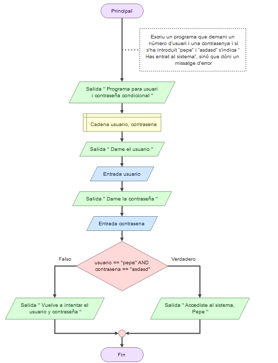
2. Realitza un algorisme que calculi la potència, per això demana per teclat la base i l'exponent. Poden passar tres coses:

* L'exponent sigui positiu, només heu d'imprimir la potència.
* L'exponent sigui 0, el resultat és 1.
* L'exponent sigui negatiu, el resultat és 1/potència amb l'exponent positiu.

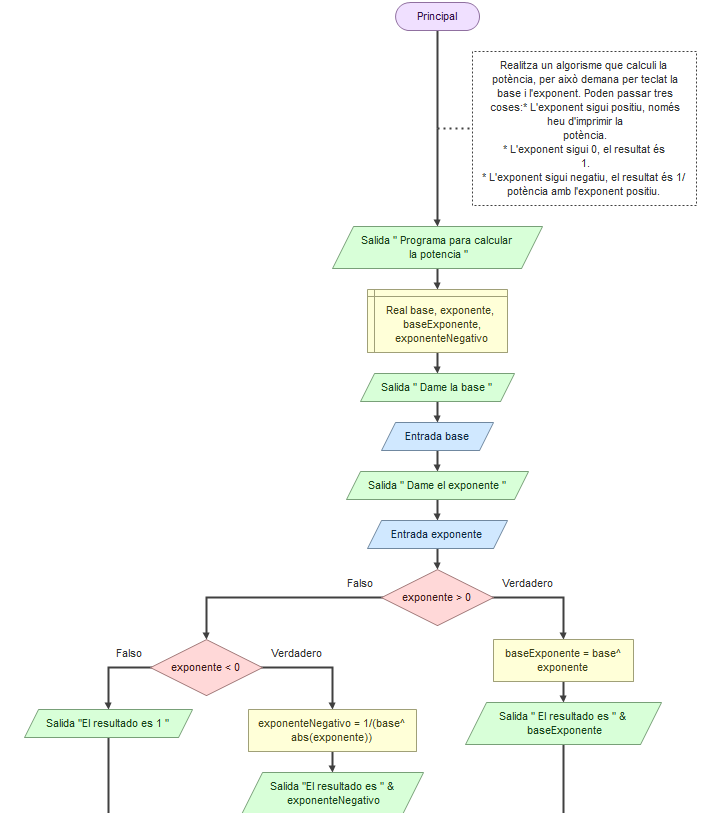

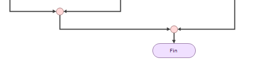

* 
* Algorisme que demani dos números 'nota' i 'edat' i un caràcter 'sexe' i mostri el missatge 'ACCEPTADA' si la nota és major o igual a cinc, l'edat és major o igual a divuit i el sexe és 'F' . En cas que es compleixi el mateix, però el sexe sigui 'M', heu d'imprimir 'POSSIBLE'. Si no es compleixen aquestes condicions s'ha de mostrar “NO ACCEPTADA”.

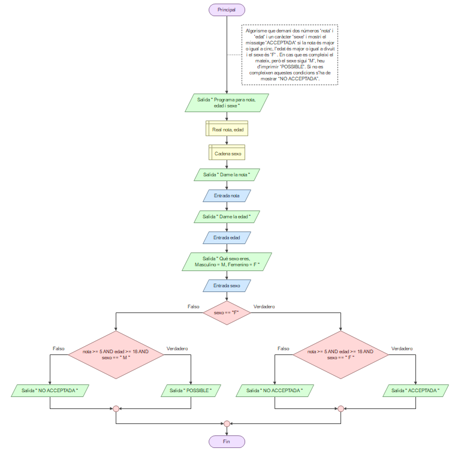

* Algorisme que demani tres números i els mostri ordenats (de major a menor)

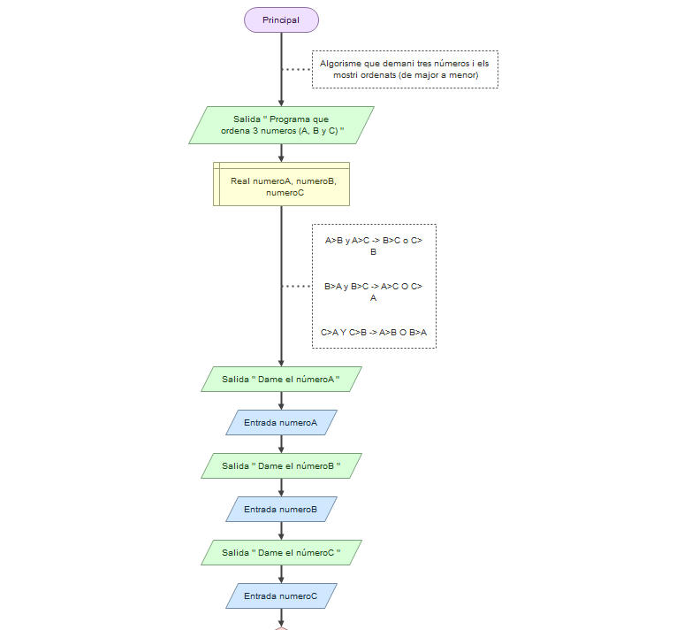

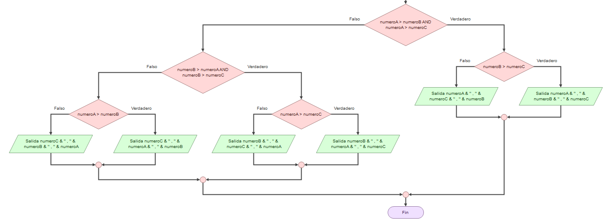

mejora por si tienes números iguales: el 8 8 3 no me funciona

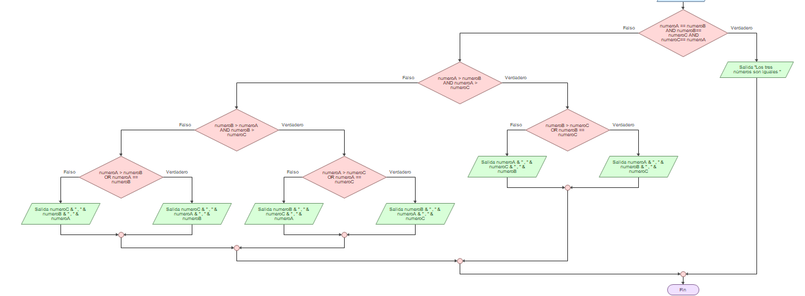

(pasar el bueno)

* El director d'una escola organitza un viatge d'estudis i requereix determinar quant ha de cobrar a cada alumne i quant ha de pagar a la companyia de viatges pel servei. La manera de cobrar és la següent: si són 100 alumnes o més, el cost per cada alumne és de 65 euros; de 50 a 99 alumnes, el cost és de 70 euros, de 30 a 49, de 95 euros, i si en són menys de 30, el cost de la renda de l'autobús és de 4000 euros, sense importar el nombre d'alumnes. Realitzeu un algorisme que permeti determinar el pagament a la companyia d'autobusos i el que ha de pagar cada alumne pel viatge.

  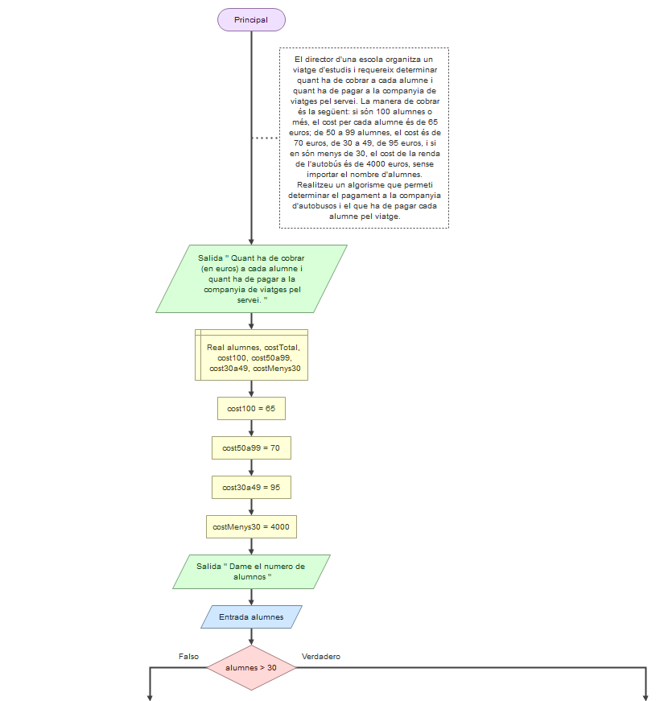

  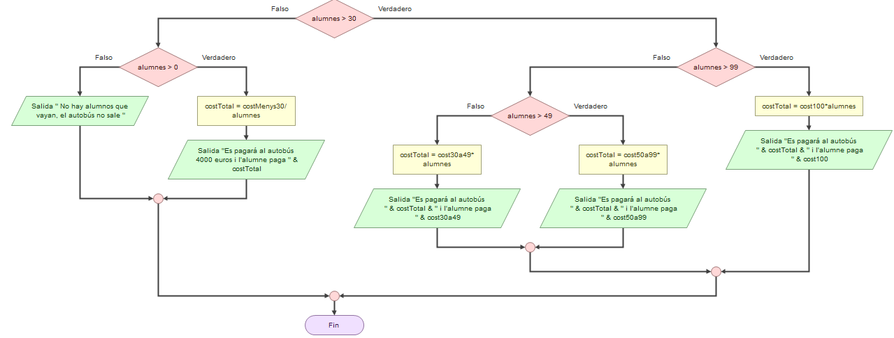
* Escriviu un programa que demani un nombre enter entre un i dotze i imprimeixi el nombre de dies que té el mes corresponent.

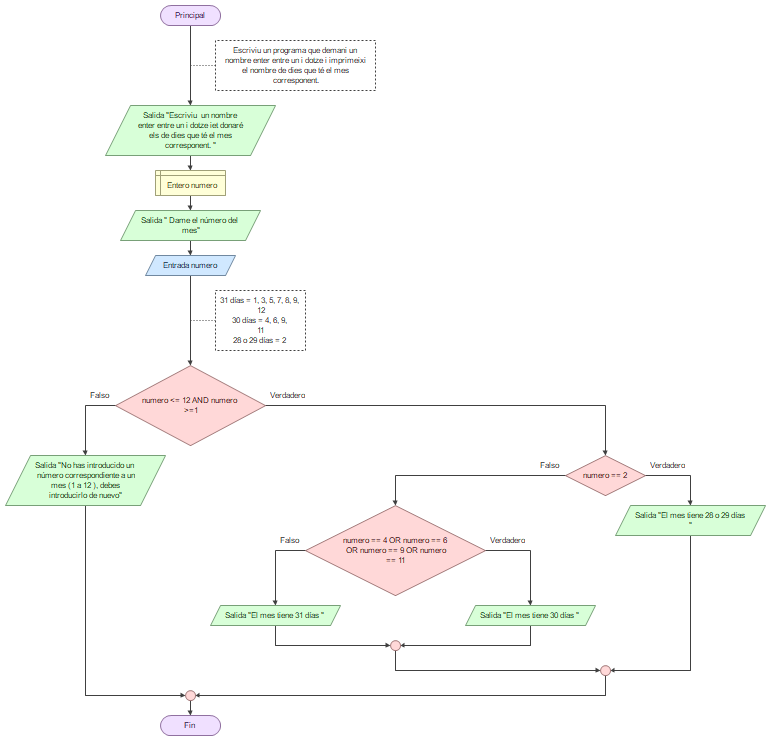


---


# Estructura iterativas

3 tipos

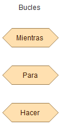

ciclos do o hacer

  Los otros dos no sabemos cuantas veces, dependen de una condición

## CICLO FOR: (o para)

Tenemos que usar una variable para la cantidad de veces del contador

**Sabemos cantidad de iteraciones que se van a realizar**

Dar valor inicial del contador ( 0 o 1)

Y el valor final 9 (si el primero era 0), para que haga 10 ciclos

puede ser de incrementar o decrementar

Funciones un número determinado de veces (iteraciones) que conocemos

Para hacer tabla mutiplicar, o para hacer operaciones un número de veces.

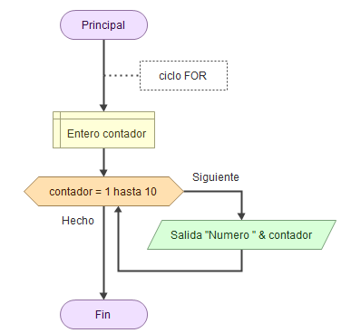

Ejemplo valor inicial 1 hasta 10:


## CICLO WHILE: (o mientras)

Aquí lo que establecemos es una condicion (numérica o no, como un boleano, letras...)

Ha de tener un control para parar el bucle (debajo de la salida), en este caso para que siga después del 1

no sabemos cuantas veces, dependen de una condición


## Ciclo DO WHILE: (o hacer)

La orden se ejecuta como mínimo una vez

no sabemos cuantas veces, dependen de una condición

Primero haces una condición de verdadero o falso

usarlo para cuando las funciones del bucle como mínimo hayan de producirse 1 vez


## WHILE vs DO while

en el while si no se cumple condición, no se va a producir.

En do while, todo y que variable inicial no cumpla condición si se produce el primer ciclo

# Ejercicios o Aplicaciones

Realizar un algoritmo que pida numeros (se pedirá por teclado la cantidad de números a introducir). El programa debe informar de cuantos números introducidos son mayores que 0, menores que 0 e iguales a 0.

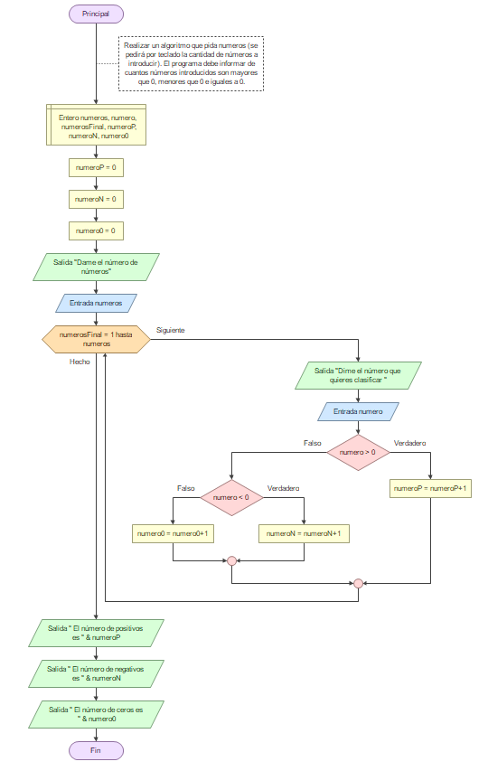

Profe:

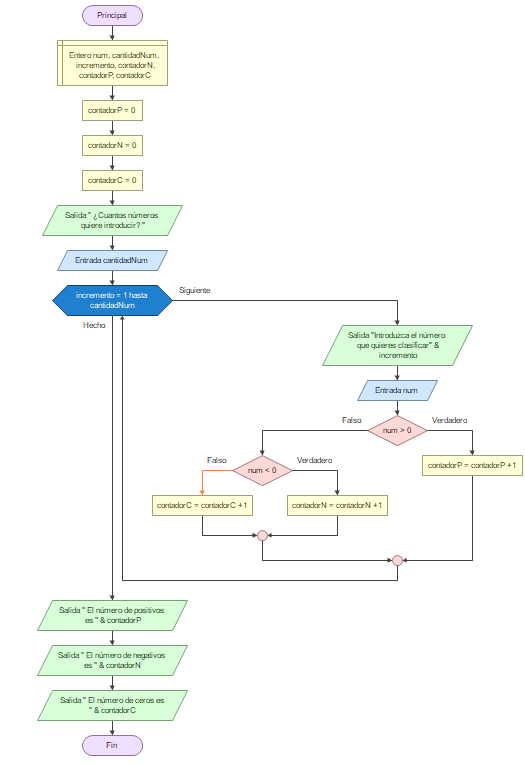

Algoritmo que pida números hasta que se introduzca un cero. Debe imprimir la suma y la media de todos los números introducidos.

-Mio

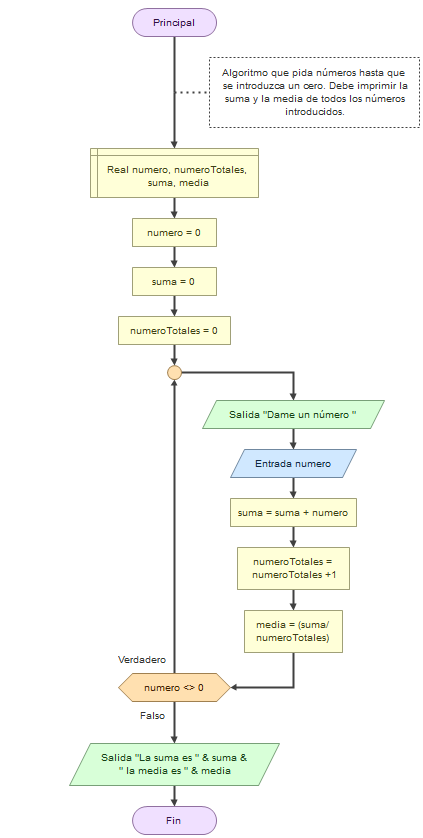

-Profe

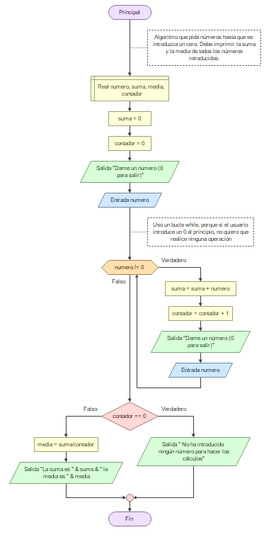

y para controlar los decimales:

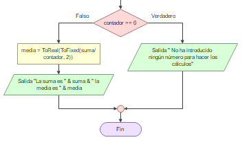

contador es el numero de datos que va introduciendo el usuario

while porque si el usuario te da un 0, no quiere que ejecute ningún cálculo

Si no pulsa 0, la suma se va acumulando junto al contador

Al poner 0, salta y evalua:

    -Primer resultado es 0

    -Si el primero no es 0, calcula la media

ToFixed convierte lo de dentro en una cadena "XXXX", para volver a un número real has de poner ToReal antes.

*Crea una aplicación que permita adivinar un número. La aplicación va a generar un número aleatorio del 0 al 100. A continuación, va pidiendo números y va respondiendo si el número a adivinar es mayor o menor que el introducido. Además, los intentos que te quedan (tienes 10 intentos para acertarlo). El programa temina cuando se acierta el número (además te dice cuantos intentos lo has acertado), si se llega al limite de intentos te muestra el número que había generado.

    función Random (101), para generar un número aleatorio del 0 al 100 (es decir, entre 0 y el número que le demos, menos 1)

-Mio

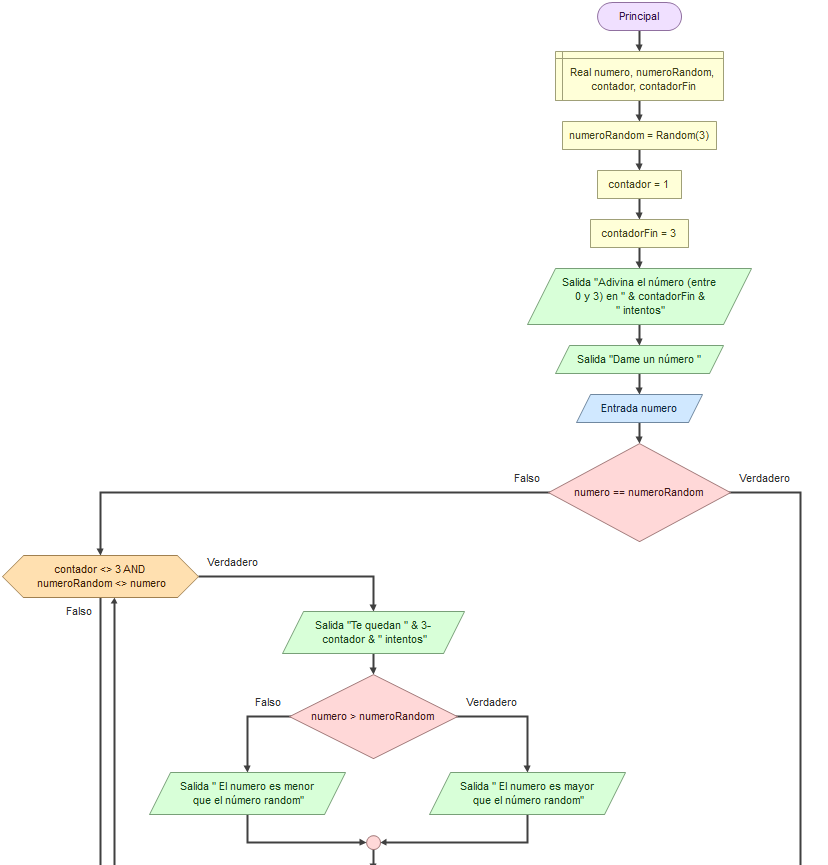

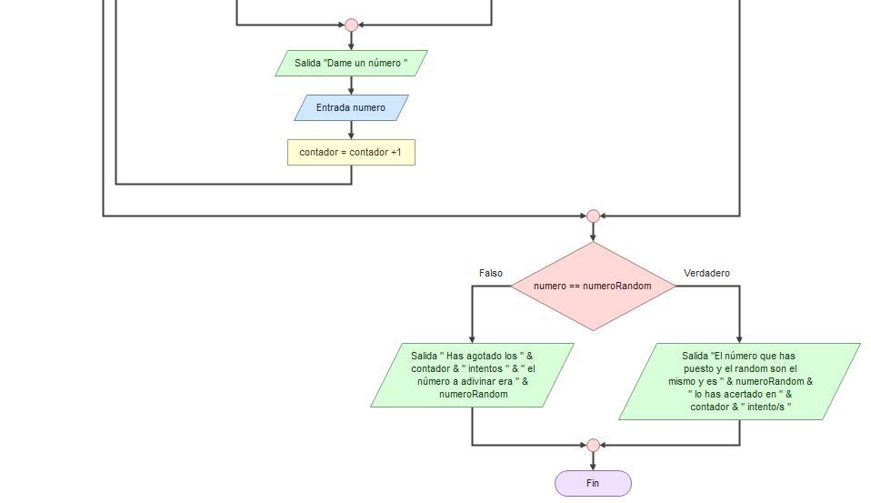

Se puede optimizar el mío

-Profe


    segunda versión en el mobil (pasarlo)

10/05/24

Escribir un programa que imprima todos los números pares entre dos números que se le pidan al usuario

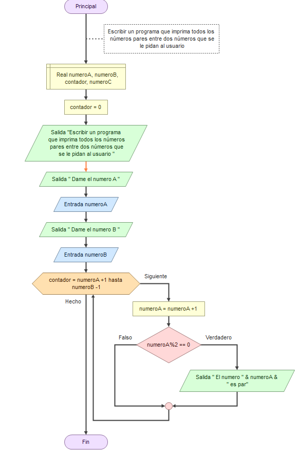


-profe:

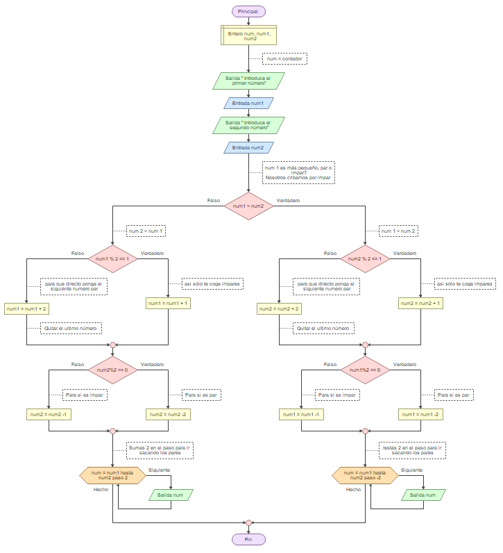

    para negativos lo duplicas y pones valores absoultos y, al final multiplicas por -1

esta disposición del codigo es aurea, y es elegante! Algo fundamental para una empresa

Ejercicio extra:

*Realizar un algoritmo que muestre la tabla de multiplicar de un número introducido por teclado


# Estructuras iterativas

Las estructuras iterativas (también llamadas estructuras repetitivas, ciclos o bucles), nos permiten ejecutar una serie de instrucciones un número determinado de veces o bien mientras se cumple determinada condición.

## Ciclo FOR o PARA


La instrucción `Para` ejecuta una secuencia de instrucciones un número determinado de veces.


* Al ingresar al bloque, la variable `contador` recibe el `valor inicial` y se ejecuta la secuencia de instrucciones que forma el cuerpo del ciclo.
* Luego se incrementa la variable `contador` en `paso` unidades y se evalúa si el valor almacenado en `contador` superó al `valor final`.
* Si esto es falso se repite hasta que `contador` supere a `valor final`.
* Por defecto, el Paso es de a `1` y la dirección `Incrementar`. Podemos modificar el paso según lo necesitado y la dirección a `Decrementar`.

## Ciclo WHILE o Mientras

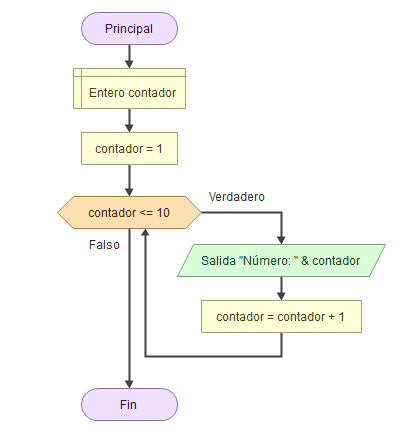

La instrucción `Mientras` ejecuta una secuencia de instrucciones mientras una condición sea verdadera.

* Al ejecutarse esta instrucción, la condición es evaluada. Si la condición resulta verdadera, se ejecuta una vez la secuencia de instrucciones que forman el cuerpo del ciclo. Al finalizar la ejecución del cuerpo del ciclo se vuelve a evaluar la condición y, si es verdadera, la ejecución se repite. Estos pasos se repiten mientras la condición sea verdadera.
* Se puede dar la circunstancia que las instrucciones del bucle no se ejecuten nunca, si al evaluar por primera vez la condición resulta ser falsa.
* Si la condición siempre es verdadera, al ejecutar esta instrucción se produce un ciclo infinito. A fin de evitarlo, las instrucciones del cuerpo del ciclo deben contener alguna instrucción que modifique la o las variables involucradas en la condición, de modo que ésta sea falsificada en algún momento y así finalice la ejecución del ciclo.

## Ciclo DO WHILE o Hacer


La instrucción `Hacer` ejecuta una secuencia de instrucciones hasta que la condición sea verdadera.

* Al ejecutarse esta instrucción, la secuencia de instrucciones que forma el cuerpo del ciclo se ejecuta una vez y luego se evalúa la condición. Si la condición es falsa, el cuerpo del ciclo se ejecuta nuevamente y se vuelve a evaluar la condición. Esto se repite hasta que la condición sea verdadera.
* Hay que tener en cuenta que, dado que la condición se evalúa al final, las instrucciones del cuerpo del ciclo serán ejecutadas al menos una vez.
* Además, a fin de evitar ciclos infinitos, el cuerpo del ciclo debe contener alguna instrucción que modifique la o las variables involucradas en la condición de modo que en algún momento la condición sea verdadera y se finalice la ejecución del ciclo.


---


# Estructuras de datos

Las matrices en python no existen, están en un modulo externo y se tienen que importar.

## Una Array / Matriz / Arreglo

Si tenemos que almacenar unos nombres dentro de una variable (en una clase)

 Sería tal que:

- alumno1
- alumno2
- alumno3...
- alumnoN

-**Array es una estructura que puede almacenar tantos datos como queramos.** Tiene un valor tal que:

array [valor1, valor2, valor3... valorN]

    El valor puede ser entero, real cadena de caracteres o boleano, pero siempre el mismo tipo de dato (no en todos los lenguajes).

-Tiene siempre un í**ndice que empieza siempre por 0, que corresponde al valor 1, el índice del ultimo valor será la longitudArray-1**

## Ejemplos

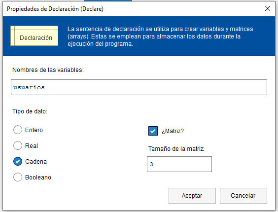

nombre variable, tipo de dato + matriz y tamaño

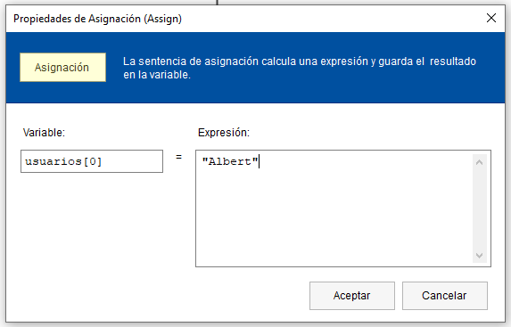

nombre variable y entre corchetes el nombre del índice


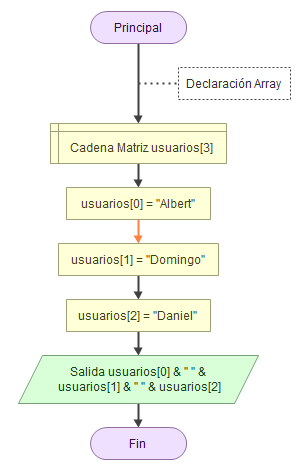

Consola nos da:


## La función PARA junto a las Array

La función PARA es de vital importancia para leer una array si es muy larga:


Tienes que tener una variable contador declarada antes, para hacer el bucle y poder representar los valores dentro del array.


Array para introducir datos:

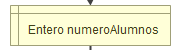

declarar la variable del numero total de la matriz

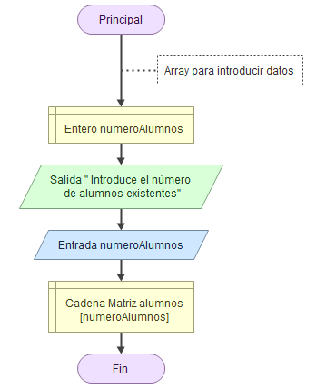

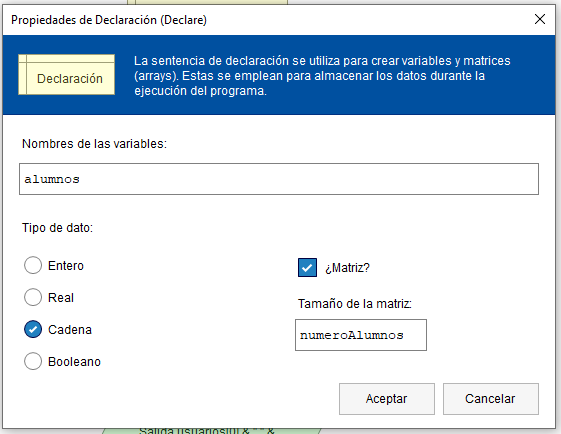


## Para guardar una array

Ahora falta iniciar cada uno de los indices:

    para ello tendremos la variable contador, en la salida le tenemos que poner contador +1(para que el usuario lo vea), ya que el contador que vale 0 es el alumno 1, e indice de la Array = 0!


Ayuda -> documentación tienes las -> funciones intrinsecas -> Size () , para saber la cantidad de datos que tiene el array

    Size () , para saber la cantidad de datos que tiene el array, o la longitud de la misma array

Ahora recorremos de nuevo la array:


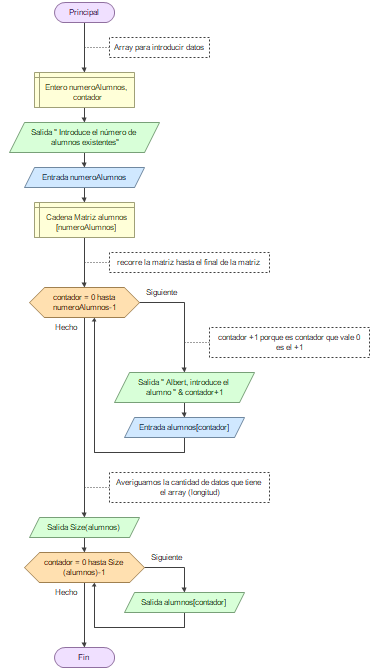

 **el segundo bucle recorre la array**  y te printa el alumno con el índice.

## Ejercicios:

*Realizar un programa que defina un vector llamado "vector_numero" de 10 enteros, a continuación lo inicialice con valores aleatorios ( del 1 al 10) y posteriormente muestre en pantalla cada elemento del vector junto con su cuadrado y su cubo.

- mio

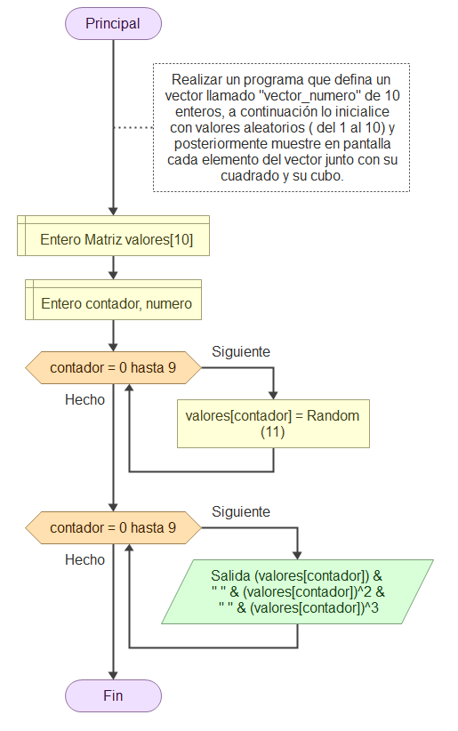

- Profe

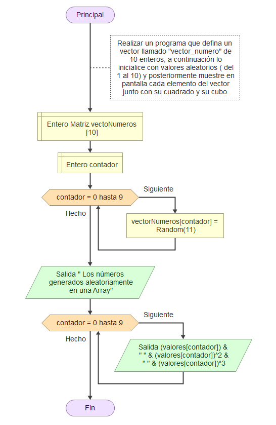

* Se requiere realizar un programa que lea por teclado las 5 notas obtenidas por un alumno ( comprendidas entre 0 y 10). A continuación debe mostrar todas las notas, la nota media, la nota más alta que ha sacado y la menor.


- Profe


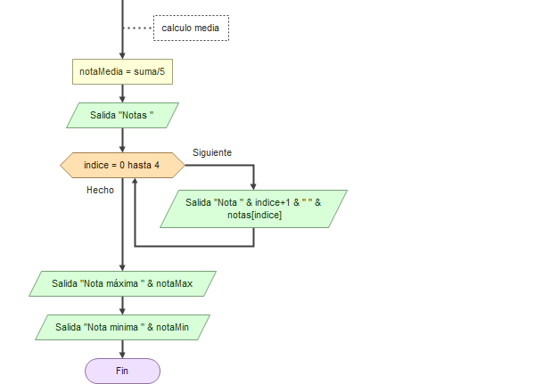

*Crear un vector de 5 elementos de cadenas de caracteres, inicializa el vector con datos leídos por el teclado. Copia los elemenos del vector en otro vector pero en orden inverso, y muestralo por pantalla.

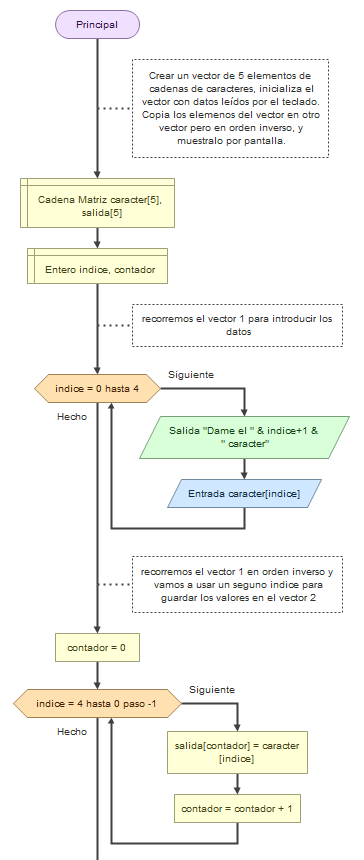


*Programa que declare un vector de diez elementos enteros y pida números para rellenarlo hasta que se llene el vector o se introduzca un número negativo. entonces se debe imprimir el vector (sólo los elementos introducidos)


 Con este cambio usando el -1 me evito de que salga el número negativo. Aún así no es recomendable usar el PARA, sólo usarlo en numero determinado de iteraciones.

-Profe


*Hacer un programa que inicialice un vector de números (10 enteros) con valores aleatorios, y posteriormente ordene los elementos de menor a mayor.


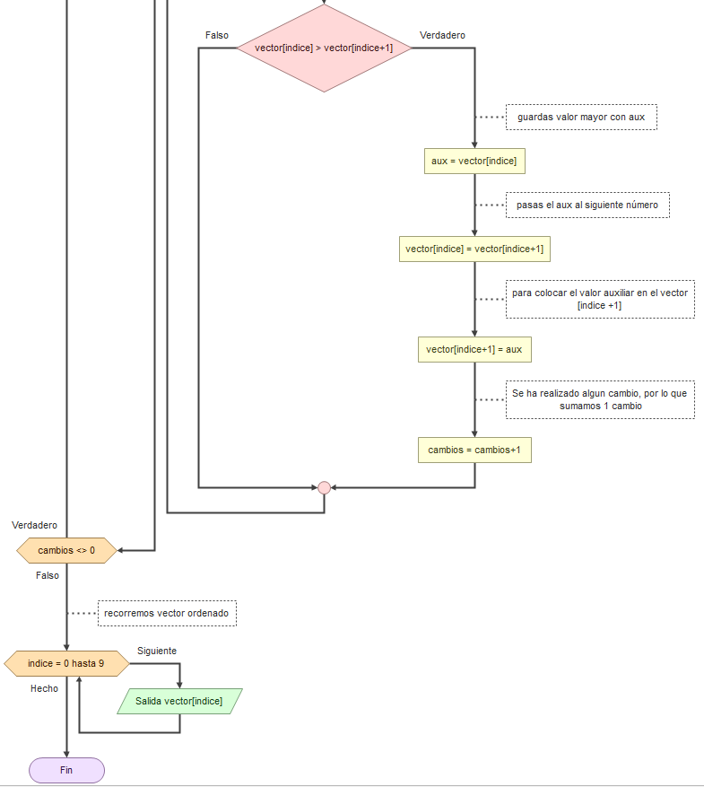

*Queremos guardar los nombres y las edades de los alumnos de un curso. Realiza un programa que introduzca el nombre y la edad de cada alumno. El proceso de lectura de datos terminará cuando se introduzca como nombre un asterisco ( " * " ). Al finalizar se mostrará los siguientes datos:

    -Todos los alumnos mayores de edad.

    -El alumno mayor (el que tiene más edad)


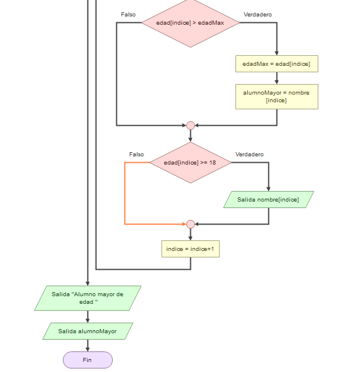


# Estructuras de datos

Hasta ahora, para hacer referencia a un dato utilizábamos una variable. El problema se plantea cuando tenemos gran cantidad de datos que guardan entre sí una relación. No podemos utilizar una variable para cada dato.

Para resolver estas dificultades se agrupan los datos en un mismo conjunto, estos conjuntos reciben el nombre de  **estructura de datos** .

## Arregos o arrays

Un array (o arreglo) es una estructura de datos con elementos homogéneos, del mismo tipo, numérico o alfanumérico, reconocidos por un nombre en común. Para referirnos a cada elemento del array usaremos un índice (empezamos a contar por 0).

## Declaración de un array

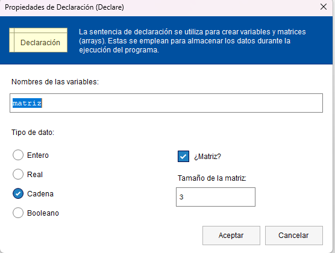

Asignaremos un nombre al array, el tipo de dato que vamos a tratar, y su tamaño (longitud o dimensión).

## Acceso a los datos del array

Para acceder a cada uno de los datos de un array, usaremos su índice encerrado entre corchetes "[]": `nombreArray[indice]`

Para acceder a todos los elementos de un array, podemos hacer uso de un bucle (el ideal es el bucle **PARA** o **FOR**).

Como el índice de un array siempre empieza por el número "0", la última posición siempre será la longitud del array menos 1.

Ejemplo:

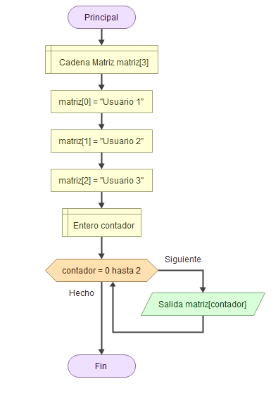

En este caso podemos observar lo siguiente:

* Declaramos un array de cadenas de carácteres con una longitud de 3 elementos.
* Inicializamos manualmente cada uno de los elementos del array, accediendo por su índice.
* Declaramos un contador para el bucle FOR.
* Recorremos el array empezando por la posición 0 (primer índice) hasta la posición 2 (longitud 3, restamos 1).

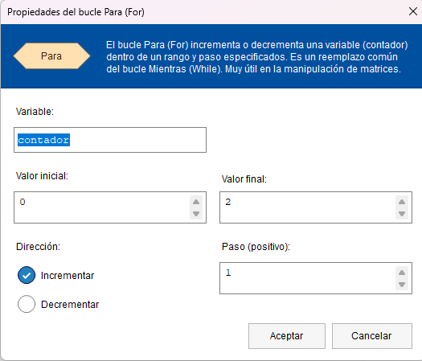


---


# Programación Funcional

Paradigma de la programación.

Crear subrutinas de un programa para poder reutilizar-las.

    Por ejemplo, tenemos la función o subrutina multiplicar y la vas llamando para cuando quieras multiplicar

## Procedimientos y Funciones

**Procedimiento:** nunca retornan un valor.

**Función**: siempre retorna un valor. a una determinada llamada

    A nivel práctico siempre se llama a todo función.

**Ambas:**

    - pueden llevar argumentos o variables con un valor que les vamos a insertar. No es obligatorio que lo tengan

    - Tienen**dos partes:**

    **Definición:** puedes llamar a parámetros

    **Invocación:** le pasas a la función los argumentos.

    parametros y argumentos es lo mismo, solo que el parámetro 		  pasado a función es el argumento. Son variables

Los argumentos se pueden pasar por valor o referencia:

    Como valor le pasas un número, cadena o lógico

    Como referencia le pasas una variable, que tiene un valor dentro

## Ejemplos Parámetros y Funciones

En flowgorithm:


Procedimiento sin parámetro


[Para python todo son objetos y, por tanto , la programación se hace orientada a objetos.]

Hasta ahora tenemos subrutinas:

 

hacemos una salida:

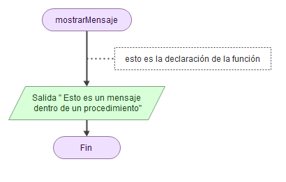

ahora vamos a principal:

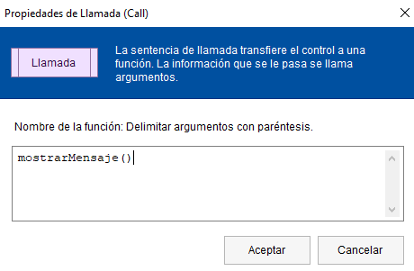

 el parentesis vacio sirve para:

    Si encontramos a un nombre reservado, va a ser una función o metodo. Si el parentesis está vació va a ser un metodo o función.


Lo ejecutamos y te muestra el mensaje que habiamos puesto en la salida del mostrarMensaje.

Esto lo guardo y lo llamo "procedimiento sin parametros".

Abrimos uno nuevo procedimiento con parametros:

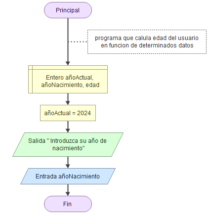

El primer parametro será primer argumento y así consecutivamente, ya que el nombre de parámetro (podrías poner el nombre tal cual, pero se usa uno acortado)


Hacemos función:


El orden tiene que ser el mismo al que hemos puesto antes. Simplemente le estamos poniendo una etiqueta

Como ningun retorno y aceptar


Vamos a principal y le das a play


**Hay que tener en cuenta el ambito de las variables o scope del locke:**

* Una variable sólo existe dentro de la función, no está en el principal.
* Una variable declarada en la función principal sóo está en esta.

No siemrpe es así, pero sí por defecto.

**Una vez la función se deja de ejecutar esa variable no existe.**

La edad tiene ambito en la principal, pero no en la función y al inreves.

Lo guardo como procedimiento con parametros.

Ahora mismo programa, pero en vez de ser procedimiento será una función, por lo tanto retorna un valor:


En edad vamos a almacenar el resultado de calculo de edad.

Ahora hacemos función


Aqui si retorno, edad


Volvemos a principal

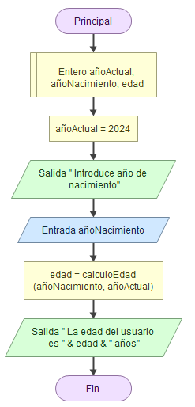

El amito local tiene la funcion edad de la funcion

El ambito principal de edad se encuentra en el la funcion principal

Lo que estamso haciendo es dividir el procedimiento en procesos más pequeños, por lo que si una función de estas falla el programa no deja de funcionar, pero el resto de programa si va a funcionar.

Lo guardo como función como parámetros

## **Ejercicios**

*Crear un programa que pida dos número enteros al usuario y diga si alguno de ellos es múltiplo del otro. Crea una función esMultiplo que reciba los dos números, y devuelve si el primero es múltiplo del segundo.

-Con retorno

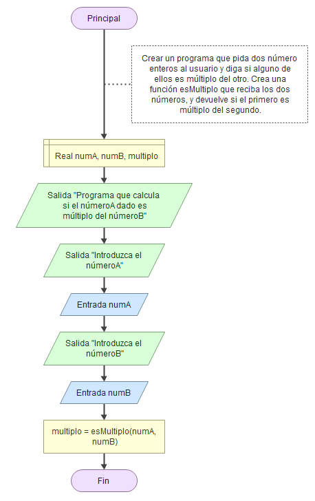


Ahora sin retorno:

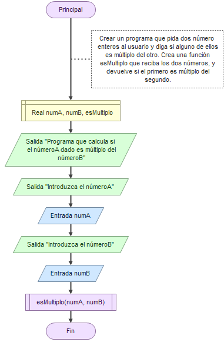

 -Profe:

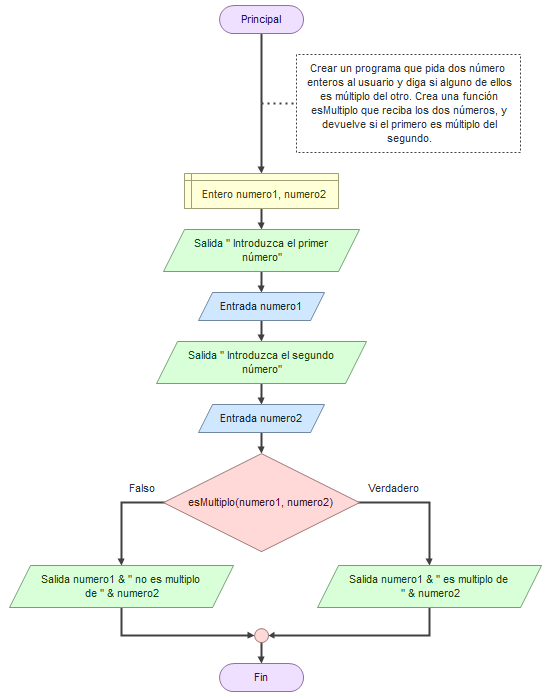

*Crear una función que calcule la temperatura media de un dia a partir de dos valores (temperatura máxima y temperatura mínima). Crear n programa principal, que utilizando la función anterior, vaya pidiendo la temperatura máxima y mínima de cada día y vaya mostrando la media. El programa pedirá el número de días que se van a introducir.

-Mio

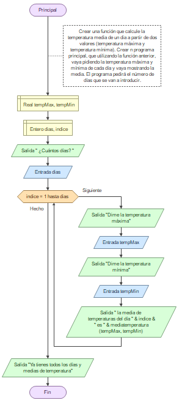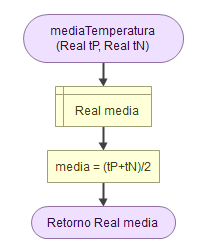

-Profe:

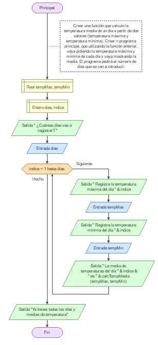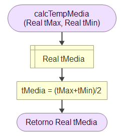

*Crea una función "calcularMaxMin" que recibe una array con valores númerico y devuelve el valor máximo y el mínimo. Crea un programa que llene el array con números aleatorios y muestre el máximo y el mínimo, utilizando la función anterior.

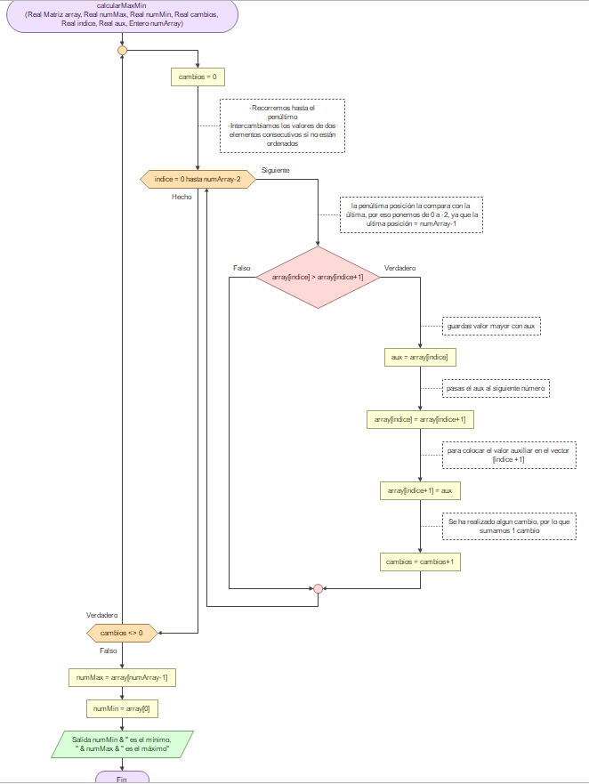

170524

-Profe


*Escribir dos funciones que permitan calcular:

    -La cantidad de segundos en un tiempo dado en horas, minutos y segundos.

    -La cantidad de horas, minutos y segundos de un tiempo dado en segundos.

Escribe un programa principal con un menú donde se pueda elegir la opción de convertir a segundos, convertir a horas, minutos y segundos o salir del programa.

-Mio


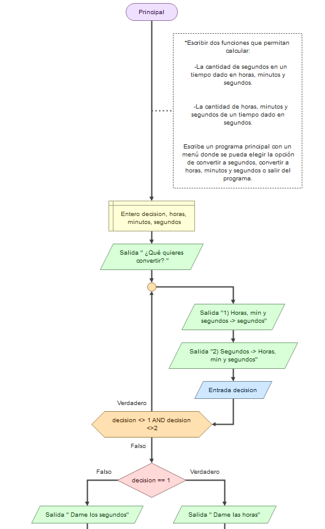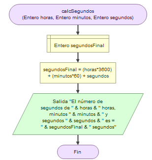

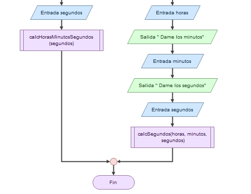

Otra versión:

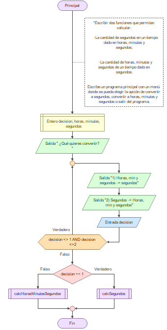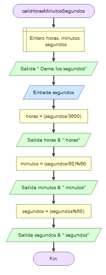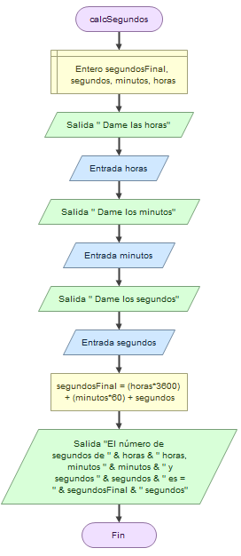

Profe:

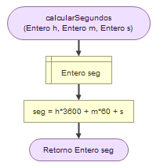

Con Int() le quitas los decimales al número de dentro.


# Programación estructurada (funcional)

La programación estructurada (modular o funcional) es un paradigma de la programación orientado a mejorar la claridad, la calidad y el tiempo de desarrollo de un programa o algoritmo, usando subrutinas (funciones o procedimientos) y tres estructuras: secuencial, condicional e iterativa.

Este paradigma de la programación consiste en dividir un programa entero en módulos o subprogramas para hacerlo más legible y manejable.

Cuando aplicamos programación modular, un problema complejo lo dividimos en diversos subproblemas más simples, y éstos a su vez en otros más simples todavía.

Además, el hecho de usar subrutinas nos permite reulitzar código y no tener que repetirlo infinidad de veces.

## Tipos de subrutinas

Tenemos dos clases de subrutinas:

* Funciones: una subrutina que devuelve un valor.
* Procedimientos: una subrutina que devuelve ningún resultado.

Cada una de ellas tiene dos fases de ejecución: definición y llamada.

Para poder hacer uso de una subrutina, primero ésta tiene que estar definida. Es la parte en la que definimos todas las acciones que va a llevar a cabo.  La segunda fase, la llamada, es cuando vamos a decirle que ejecute las acciones que hemos definido.

## Parámetros y argumentos

Tanto las funciones como los procedimientos pueden llevar argumentos o parámetros, y aunque son prácticamente lo mismo, conviene diferenciarlos:

* Parámetros: son las variables que recibe la función y se crean cuando la definimos. Su contenido lo reciben cuando llamamos a la función con los argumentos.
* Argumentos: son las expresiones que usamos cuando llamamos a la función.

## Scope o ámbito de las variables

Las variables definidas dentro de una función no existen en otras funciones o el programa principal. De la misma forma, las variables del programa principal no existen dentro de la función. (Nota: aunque ésto no es del todo cierto en algunos lenguajes de programación como JavaScript).

## Ejemplos:

### Procedimiento sin parámetros

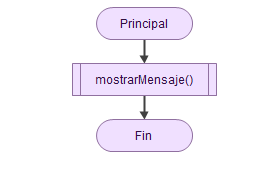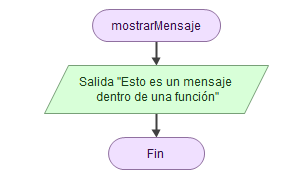

### Procedimiento con parámetros

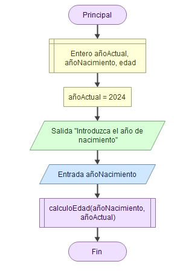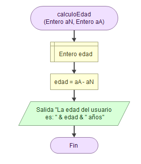

### Función con parámetros

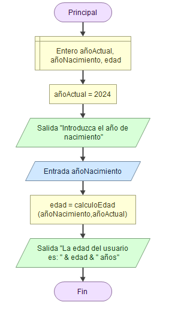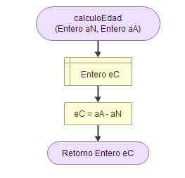


---
